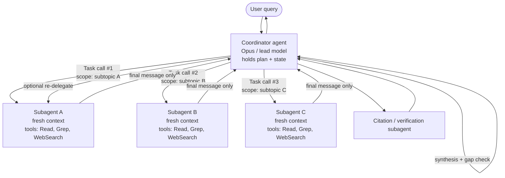

## Qué cubre esta sección

Cómo diseñar un coordinador hub-and-spoke que descompone trabajo, crea subagentes aislados mediante la herramienta `Task`/`Agent`, pasa contexto completo en cada prompt e impone prerrequisitos deterministas (hooks, gates) para que los workflows de varios pasos traspasen el control limpiamente — a otros agentes o a humanos — sin perder estado.

## Material fuente (de la guía oficial)

### 1.2 Patrones coordinador–subagente

- **Arquitectura hub-and-spoke**: un único agente coordinador gestiona toda la comunicación entre subagentes, el manejo de errores y el enrutamiento de información.
- **Aislamiento de contexto**: los subagentes **no** heredan el historial conversacional del coordinador. Cada uno empieza con una ventana nueva.
- **Responsabilidades del coordinador**: descomposición de tareas, delegación, agregación de resultados, selección dinámica de qué subagentes invocar según la complejidad de la consulta (en vez de enrutar ciegamente por toda la pipeline).
- **Riesgo clave**: descomposición demasiado estrecha. El ejemplo canónico del examen es la consulta sobre "creative industries" que se divide en *digital art, graphic design, photography* y omite silenciosamente música, escritura y cine.
- **Habilidades evaluadas**: selección dinámica de subagentes, partición de alcance para minimizar duplicación, bucles de refinamiento iterativo (re-delegar cuando la síntesis revela brechas), enrutar cada llamada por el coordinador para observabilidad.

### 1.3 Invocación de subagentes y paso de contexto

- **Mecanismo de creación**: la herramienta `Task` (renombrada `Agent` en Claude Code v2.1.63; ver [nota del SDK](#nota-sobre-task-frente-a-agent)). El coordinador debe listar esta herramienta en `allowedTools`.
- **Contexto explícito**: el contexto del subagente es lo que pongas en la cadena del prompt. No hay herencia automática de la conversación padre, resultados de herramientas ni memoria.
- **`AgentDefinition`**: objeto de configuración por subagente que contiene `description` (cuándo invocar), `prompt` (system prompt), `tools` / `disallowedTools` (restricciones de capacidad) y opcionales `model`, `skills`, `mcpServers`, `permissionMode`.
- **`fork_session`**: ramifica una sesión en una nueva que comparte historial previo hasta un mensaje elegido; se usa para exploración divergente desde una línea base común.
- **Habilidades evaluadas**: pasar hallazgos previos completos en el prompt de creación, usar formatos estructurados (contenido + metadatos: URLs, nombres de documentos, números de página), emitir múltiples llamadas `Task` en **una** respuesta del coordinador para paralelismo, y escribir prompts de estilo objetivo/criterios de calidad en vez de procedimientos paso a paso.

### 1.4 Workflows con enforcement y traspaso

- **Enforcement programático (hooks, prerequisite gates)** frente a **guía basada en prompts**: cuando se requiere cumplimiento determinista (verificación de identidad antes de una transacción financiera), los prompts por sí solos tienen una tasa de fallo no nula.
- **Protocolos de traspaso estructurado** para escalación a mitad de proceso: ID de cliente, análisis de causa raíz, acción recomendada, rastro de evidencia.
- **Habilidades evaluadas**: bloquear `process_refund` hasta que `get_customer` haya devuelto un ID verificado, descomponer solicitudes con múltiples preocupaciones en investigaciones paralelas que comparten contexto, y compilar resúmenes de escalación para humanos que no tienen la transcripción.

## Profundización arquitectónica

### Topología hub-and-spoke

El coordinador es el *único* nodo que habla con subagentes. Los subagentes nunca se dirigen entre sí directamente. Cada resultado vuelve al hub, que decide qué hacer después.



De esta topología se derivan dos propiedades: **observabilidad** (toda acción pasa por un nodo, de modo que el logging del coordinador captura el grafo causal completo) y **radio de impacto acotado** (un subagente problemático corrompe solo su propio contexto; su mensaje final es lo único que ve el hub, y el hub puede rechazarlo o re-delegar).

La función Research de Anthropic usa exactamente este patrón: un `LeadResearcher` (Opus) planifica, persiste el plan en memoria (la ventana de 200k puede truncarse a mitad de tarea), crea subagentes paralelos (Sonnet) y entrega hallazgos a un `CitationAgent` que reatribuye cada afirmación. Anthropic reporta una **mejora del 90.2%** sobre Claude Opus 4 de agente único en evals internas, a **~15× los tokens de un chat**: económico solo cuando el valor de la tarea es alto. ([blog de ingeniería de Anthropic](https://www.anthropic.com/engineering/multi-agent-research-system))

### Por qué importa el aislamiento de contexto

La ventana de cada subagente empieza vacía. El Agent SDK documenta el límite con precisión ([Subagents in the SDK](https://code.claude.com/docs/en/agent-sdk/subagents)):

| El subagente recibe | El subagente **no** recibe |
| --- | --- |
| Su propio `AgentDefinition.prompt` | El historial conversacional o resultados de herramientas del padre |
| La cadena pasada en la llamada a la herramienta `Task`/`Agent` | El system prompt del padre |
| Definiciones de herramientas (heredadas o restringidas mediante `tools`) | Skills precargadas, salvo que se declaren en `AgentDefinition.skills` |
| `CLAUDE.md` del proyecto (cuando `settingSources` está habilitado) | Memoria que el padre acumuló en turnos anteriores |

Tres consecuencias prácticas: **(1) La compresión es la función**: un subagente puede leer cincuenta archivos; solo su mensaje final vuelve al padre, manteniendo limpio el contexto del lead. **(2) Todo lo que el subagente necesite debe estar en el prompt**: rutas de archivos, URLs previas, decisiones anteriores, la restricción del usuario de que "ya descartamos la opción B." Todo ello es responsabilidad del coordinador. **(3) Sin canal lateral**: si los subagentes necesitan estado compartido, escríbelo a un sistema de archivos o almacén externo y pasa referencias de vuelta al coordinador. Anthropic llama a esto el patrón "artifact"; evita el *juego del teléfono* donde cada traspaso degrada la fidelidad.

## Creación de subagentes con la herramienta Task

Un coordinador que puede crear subagentes necesita tres cosas: la herramienta `Task` (o `Agent`) en `allowedTools`, una o más `AgentDefinition`s y un prompt que invite a delegar. El ejemplo siguiente define dos subagentes especializados con toolsets restringidos y luego emite llamadas paralelas desde un único turno del coordinador.

```typescript
import { query, type AgentDefinition } from "@anthropic-ai/claude-agent-sdk";

const webResearcher: AgentDefinition = {
  description: "Web research specialist. Breadth-first search across the web.",
  prompt: `GOAL: JSON list of {url, title, claim, snippet, retrieved_at}.
QUALITY: prefer primary sources; 5-15 per facet; never invent URLs;
start broad then narrow (don't lead with overly specific queries).`,
  tools: ["WebSearch", "WebFetch", "Read"],
  model: "sonnet",
};

const docAnalyst: AgentDefinition = {
  description: "Document analyst. Extract structured facts from supplied files.",
  prompt: `OUTPUT: JSON list of {source_doc, page, quote, normalized_claim}.
Never paraphrase a number; quote verbatim with its page.`,
  tools: ["Read", "Grep", "Glob"],
  model: "sonnet",
};

for await (const message of query({
  prompt: `Research "the impact of AI on creative industries". Cover full
domain breadth: visual arts AND music AND writing AND film/TV AND performing
arts. Decompose into AT LEAST one subagent per medium and emit the Task calls
in a SINGLE response so they run in parallel. After synthesis, check for
omitted media and re-delegate if any are missing.`,
  options: {
    allowedTools: ["Read", "Grep", "Glob", "WebSearch", "WebFetch", "Task"],
    agents: { "web-researcher": webResearcher, "doc-analyst": docAnalyst },
  },
})) {
  if ("result" in message) console.log(message.result);
}
```

Puntos clave que evalúa el examen:

- **`"Task"` (o `"Agent"`) debe estar en `allowedTools`** del coordinador, o Claude no puede crear nada.
- **Nunca pongas `Task` / `Agent` en las `tools` de un subagente**: el SDK lo documenta como una regla estricta para evitar creación recursiva.
- **Paralelismo = múltiples llamadas de herramienta en un turno del asistente**, no turnos separados. Pide al lead que "emit the Task calls in a single response." Anthropic reporta que 3–5 subagentes paralelos (cada uno haciendo 3+ llamadas paralelas a herramientas) redujeron el tiempo de investigación hasta 90% en consultas complejas.
- **Los prompts especifican objetivos y criterios de calidad, no procedimientos.** "Objetivo + formato de salida + guía de herramientas + límites de tarea" dio a Anthropic la mayor mejora individual de calidad; instrucciones vagas causaron duplicación y brechas silenciosas.

### `fork_session` para exploración divergente

Cuando dos subagentes deben probar *enfoques distintos desde la misma línea base*, por ejemplo una rama de optimización prueba una reescritura SQL mientras otra prueba añadir un índice, usa `fork_session` en vez de crear desde cero ([Sessions docs](https://code.claude.com/docs/en/agent-sdk/sessions)). Fork copia la conversación hasta un mensaje elegido, reasigna UUIDs para evitar colisiones y etiqueta cada entrada con `forkedFrom` para linaje. Cada fork se reanuda de forma independiente; el original se preserva, ideal para exploración A/B sin contaminar la línea base.

### Nota sobre `Task` frente a `Agent`

La guía de certificación llama al mecanismo de creación la **herramienta `Task`**. El SDK la renombró a **`Agent`** en Claude Code v2.1.63. Las versiones actuales del SDK emiten `"Agent"` en bloques `tool_use` nuevos, pero todavía emiten `"Task"` en la lista de herramientas `system:init` y en `permission_denials[].tool_name`. Para el examen: trata `Task` como canónico (esa es la redacción de las preguntas). En código de producción 2026, maneja **ambos** nombres defensivamente (`block.name in ("Task", "Agent")`).

## Patrones de paso de contexto

Como los subagentes no heredan nada automáticamente, el trabajo del coordinador es empaquetar un briefing autocontenido en cada creación. El principio que recompensa el examen: **separa contenido de metadatos, en formato estructurado, para que la atribución sobreviva al traspaso.**

Un prompt de creación de alta calidad es JSON estructurado con contenido separado de metadatos:

```json
{
  "task": "Extend findings on AI's impact on the music industry.",
  "goal": "5-10 sourced 2025-2026 claims on production, distribution, royalties.",
  "prior_findings": [
    {
      "claim": "Major labels sued Suno and Udio in June 2024.",
      "source_url": "https://example.org/riaa-suno-2024",
      "source_title": "RIAA files suit against Suno",
      "retrieved_at": "2026-05-10",
      "confidence": "high"
    },
    {
      "claim": "AI-generated tracks: ~18M streams/day on Deezer in Q1 2025.",
      "source_url": "https://example.org/deezer-q1-2025",
      "page": 14, "retrieved_at": "2026-04-29", "confidence": "medium"
    }
  ],
  "open_questions": ["EU/US 2026 regulatory developments?"],
  "output_format": "list of {claim, source_url, source_title, page?, retrieved_at, confidence}",
  "do_not": ["duplicate prior findings", "rely on a single source for a number", "invent URLs"]
}
```

Por qué se premia este formato: **los metadatos viajan con el contenido** (`source_url`, `page`, `retrieved_at` sobreviven al siguiente salto, así que un agente de síntesis posterior tiene la referencia de página en vez de una paráfrasis); **las preguntas abiertas particionan el alcance** para que el subagente no repita trabajo; **las líneas explícitas de "do not"** son más baratas que reintentos; y **el schema es verificable por máquina** por el coordinador antes de re-delegar.

## Enforcement: hooks frente a prompts

La guía basada en prompts — "always call `get_customer` before `process_refund`" — es *probabilística*. Incluso un modelo Claude 4 bien ajustado tiene una tasa de fallo no nula, inaceptable para flujos financieros, de seguridad o compliance. Un hook `PreToolUse` convierte la regla en un gate determinista.

```typescript
import { query, type HookCallback, type PreToolUseHookInput } from
  "@anthropic-ai/claude-agent-sdk";

const verifiedCustomers = new Set<string>();

const requireVerifiedCustomer: HookCallback = async (input) => {
  const pre = input as PreToolUseHookInput;
  const args = pre.tool_input as Record<string, unknown>;

  if (pre.tool_name === "get_customer" && args.verified === true) {
    verifiedCustomers.add(String(args.customer_id));
    return {};
  }
  if (pre.tool_name === "process_refund" &&
      !verifiedCustomers.has(String(args.customer_id))) {
    return { hookSpecificOutput: {
      hookEventName: pre.hook_event_name,
      permissionDecision: "deny",
      permissionDecisionReason: "Refund blocked: customer not verified. " +
        "Call get_customer first and obtain a verified ID.",
    }};
  }
  return {};
};

for await (const message of query({
  prompt: "Refund order #88421 for customer C-1042.",
  options: {
    allowedTools: ["get_customer", "process_refund", "Task"],
    hooks: { PreToolUse: [{ matcher: "get_customer|process_refund",
                            hooks: [requireVerifiedCustomer] }] },
  },
})) {
  if ("result" in message) console.log(message.result);
}
```

### Cuándo usar cuál

| Preocupación | Guía basada en prompts | Enforcement programático (hooks / gates) |
| --- | --- | --- |
| Estilo, tono, formato | Sí — flexible, barato | Excesivo |
| Preferencias de orden de herramientas | Sí | Solo si está ligado a compliance |
| Verificación de identidad antes de acción financiera | **No** — la tasa de fallo no nula es insegura | **Sí** — `PreToolUse` deny |
| Escrituras a rutas protegidas (`.env`, `/etc`) | No | Sí |
| Audit logging de cada llamada de herramienta | Opcional | Sí — `PostToolUse` |
| Prerrequisitos entre subagentes | No | Sí — estado de hook entre `SubagentStart` / `SubagentStop` |
| Enrutamiento de aprobación a un humano | Posible pero no fiable | Sí — `PermissionRequest` / `canUseTool` |

Regla práctica: **si una respuesta incorrecta es irreversible o regulada, la regla va en código, no en un prompt.** Los hooks también son el lugar correcto para *normalizar* datos que fluyen entre subagentes (Domain 1.5); cuando el contenido llega a un agente posterior, ya fue verificado contra schema.

## Traspaso a humanos

Un agente humano que retoma una escalación no tiene la transcripción de la conversación. Por tanto, un resumen de traspaso bien formado forma parte del contrato del coordinador. La plantilla de abajo es lo que premian los escenarios del examen:

```yaml
handoff:
  type: human_escalation
  reason: policy_exception_required
  urgency: medium
  customer:
    id: C-1042
    verified: true
    verification_method: email_otp
    verified_at: 2026-05-15T14:22:11Z
  case:
    ticket_id: T-58219
    concerns:
      - {type: refund_request, order: O-88421, amount: 249.00, status: blocked_by_policy}
      - {type: account_merge, target: C-0997, status: needs_review}
  root_cause:
    summary: >
      Duplicate charge on O-88421 from a payments retry after a 504. Refund
      automation cannot fire because the duplicate is on a different account
      (C-0997) the customer also owns.
    evidence: [pay_log/2026-05-14T22:14Z#retry-3, orders/O-88421/events#charge-retry]
  attempted_actions:
    - {tool: get_customer, result: verified}
    - {tool: lookup_order, result: duplicate_charge_confirmed}
    - {tool: process_refund, result: blocked,
       blocked_by: prerequisite_gate (cross-account refund needs approval)}
  recommended_action:
    - merge C-1042 and C-0997 (manual review queue)
    - issue refund of 249.00 against the merged account
    - apply goodwill credit of 25.00 per playbook PB-17
  policy_refs: [PB-17, SEC-3]
```

El humano necesita **identidad** (no volver a verificar), **estado del caso** (no repetir búsquedas), **causa raíz** (no reinvestigar), **acciones intentadas y por qué fallaron** (no repetirlas ni deshacerlas), y **acción recomendada + refs de política** (consistencia con casos previos). La misma estructura también funciona para escalación de subagente a subagente.

## Modos de fallo comunes (y correcciones)

| Modo de fallo | Síntoma | Corrección |
| --- | --- | --- |
| **Descomposición estrecha** (la trampa "creative industries → only visual arts" de la pregunta 7) | Todos los subagentes completan con éxito, pero el informe final omite dominios completos en silencio. Los logs del coordinador muestran que la descomposición ya era incompleta. | El prompt del coordinador debe exigir **domain-breadth check before delegation** y una **gap audit after synthesis** con re-delegación cuando falten áreas. Etiqueta la descomposición con la lista canónica de subdominios y rechaza si falta alguno. |
| **Subagente sobreaprovisionado** (la trampa de la pregunta 9) | Un subagente de síntesis recibe herramientas completas de búsqueda web para no hacer round-trip. Resuelve latencia, rompe separación de responsabilidades; el agente de síntesis ahora también investiga. | Aplica mínimo privilegio: herramienta `verify_fact` de alcance restringido para el 85% de casos de lookup simple; mantén delegación enrutada por coordinador para el 15% de casos profundos. |
| **Secuencial donde era posible paralelo** | La latencia escala linealmente con el número de subagentes. El coordinador emite una llamada `Task`, espera, emite la siguiente. | El prompt del coordinador debe instruir explícitamente emitir múltiples llamadas `Task` en una **single response**. Confirma mediante trazas que el turno del asistente contenía N bloques `tool_use`. |
| **Falta prerequisite gate** | `process_refund` se dispara ocasionalmente sin cliente verificado, especialmente bajo deriva de prompt o upgrades de modelo. | Mueve la regla a un hook `PreToolUse` que niegue la herramienta downstream hasta que exista una bandera de estado establecida por la herramienta prerrequisito. |
| **Traspaso con pérdida a humanos** | El agente humano vuelve a verificar identidad, reinvestiga, toma una decisión distinta de la recomendación del agente. | Estandariza un schema de traspaso estructurado (ver arriba) y valídalo en el límite de escalación. |
| **Subagente con hambre de contexto** | El subagente inventa URLs, repite búsquedas previas o contradice hallazgos anteriores. | El coordinador olvidó que debe pasar *explícitamente* hallazgos previos + metadatos. Usa briefings JSON estructurados, no prosa parafraseada. |
| **Descomposición tipo juego del teléfono** | Dividir una feature entre subagentes planner / implementer / tester / reviewer; los tokens de coordinación superan los tokens de trabajo real. | Usa **descomposición centrada en contexto**: divide por límite de contexto, no por cargo. Un agente que posee una feature también posee sus pruebas. Reserva multiagente para trabajo verdaderamente paralelo y de bajo acoplamiento. ([guía de Anthropic](https://claude.com/blog/building-multi-agent-systems-when-and-how-to-use-them)) |
| **Deriva del coordinador en ejecuciones largas** | Después de 100+ turnos, el lead pierde el plan. | Persiste el plan en memoria al inicio (patrón de Research); bajo presión de contexto, crea un coordinador nuevo con el plan + resumen de traspaso. |

## Puntos de enfoque para el examen

- **Hub-and-spoke** es la topología por defecto; los subagentes nunca hablan entre sí.
- **Los subagentes no heredan nada**: ni conversación, ni resultados de herramientas, ni system prompt del padre. Empaqueta lo que necesitan en el prompt `Task`.
- **`Task` en `allowedTools` del coordinador**, nunca en las `tools` de un subagente (recursión).
- **`AgentDefinition`** = `description`, `prompt`, `tools`/`disallowedTools`, más opcionales `model`, `skills`, `mcpServers`, `permissionMode`.
- **Paralelismo = múltiples llamadas `Task` en un turno del coordinador.** Secuencial es el modo de fallo.
- **Los prompts especifican objetivos y criterios de calidad**, no pasos procedimentales.
- **Pasa hallazgos previos con metadatos** (URL, doc, página, timestamp de recuperación) en forma estructurada.
- **`fork_session`** = exploración divergente desde una línea base compartida. No es lo mismo que descomposición paralela.
- **Hooks > prompts para cumplimiento determinista.** La verificación de identidad antes de operaciones financieras pertenece en un hook `PreToolUse`.
- **Traspaso estructurado** a humanos: ID de cliente, estado de verificación, estado del caso, causa raíz, acciones intentadas, acción recomendada, refs de política.
- **Trampa "creative industries"**: todos los subagentes tienen éxito pero la cobertura es incompleta → la *descomposición* del coordinador es la causa raíz.
- **Trampa "over-provisioned synthesis agent"**: limita las herramientas nuevas al caso del 85% (mínimo privilegio); mantén delegación enrutada por coordinador para el 15%.
- Multiagente cuesta **3–15× más tokens** que agente único. Solo se justifica para tareas de alto valor, paralelizables y breadth-first.

## Referencias

- [Anthropic — How we built our multi-agent research system](https://www.anthropic.com/engineering/multi-agent-research-system)
- [Anthropic — When to use multi-agent systems (and when not to)](https://claude.com/blog/building-multi-agent-systems-when-and-how-to-use-them)
- [Claude Agent SDK — Subagents in the SDK](https://code.claude.com/docs/en/agent-sdk/subagents)
- [Claude Agent SDK — Create custom subagents](https://code.claude.com/docs/en/sub-agents)
- [Claude Agent SDK — Work with sessions (incl. `fork_session`)](https://code.claude.com/docs/en/agent-sdk/sessions)
- [Claude Agent SDK — Intercept and control agent behavior with hooks](https://code.claude.com/docs/en/agent-sdk/hooks)
- [Claude Agent SDK — Handle approvals and user input](https://code.claude.com/docs/en/agent-sdk/user-input)
- [Claude Agent SDK — TypeScript reference (`AgentDefinition`)](https://code.claude.com/docs/en/sdk/sdk-typescript)
- [Anthropic cookbook — Agent workflow patterns](https://platform.claude.com/cookbook/patterns-agents-basic-workflows)
