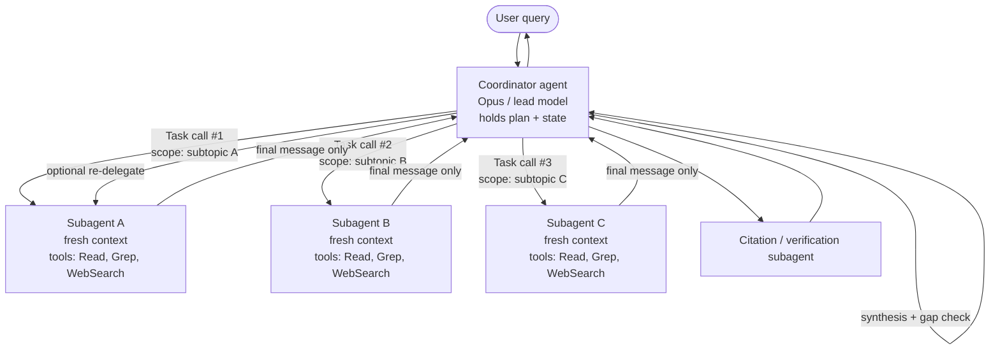

## Ce que couvre cette section

Comment concevoir un coordinateur hub-and-spoke qui décompose le travail, lance des subagents isolés via l'outil `Task`/`Agent`, transmet un contexte complet dans chaque prompt, et impose des prérequis déterministes (hooks, gates) afin que les workflows multi-étapes passent proprement le relais — à d'autres agents ou à des humains — sans perdre l'état.

## Matériel source (guide officiel)

### 1.2 Motifs coordinateur–subagent

- **Architecture hub-and-spoke** : un seul agent coordinateur gère toute la communication inter-subagents, la gestion d'erreurs et le routage de l'information.
- **Isolation du contexte** : les subagents n'héritent **pas** de l'historique de conversation du coordinateur. Chacun démarre avec une fenêtre fraîche.
- **Responsabilités du coordinateur** : décomposition de tâche, délégation, agrégation des résultats, sélection dynamique des subagents à invoquer selon la complexité de la requête (plutôt que routage aveugle dans tout le pipeline).
- **Risque clé** : décomposition trop étroite. L'exemple canonique de l'examen est la requête "creative industries" découpée en *digital art, graphic design, photography* qui omet silencieusement musique, écriture et cinéma.
- **Compétences testées** : sélection dynamique des subagents, partitionnement du périmètre pour minimiser les doublons, boucles de raffinement itératif (redéléguer quand la synthèse révèle des lacunes), routage de chaque appel via le coordinateur pour l'observabilité.

### 1.3 Invocation de subagents et passage de contexte

- **Mécanisme de lancement** : l'outil `Task` (renommé `Agent` dans Claude Code v2.1.63 — voir [note SDK](#note-sur-task-vs-agent)). Le coordinateur doit lister cet outil dans `allowedTools`.
- **Contexte explicite** : le contexte du subagent est exactement ce que vous mettez dans la chaîne de prompt. Pas d'héritage automatique de conversation parente, de résultats d'outils ou de mémoire.
- **`AgentDefinition`** : objet de configuration par subagent contenant `description` (quand l'invoquer), `prompt` (prompt système), `tools` / `disallowedTools` (restrictions de capacités), et optionnellement `model`, `skills`, `mcpServers`, `permissionMode`.
- **`fork_session`** : branche une session vers une nouvelle qui partage l'historique antérieur jusqu'à un message choisi — utilisé pour une exploration divergente depuis une base commune.
- **Compétences testées** : passer les résultats antérieurs complets dans le prompt de spawn, utiliser des formats structurés (contenu + métadonnées : URLs, noms de docs, numéros de page), émettre plusieurs appels `Task` dans **une seule** réponse du coordinateur pour le parallélisme, et écrire des prompts de type objectif/critères qualité plutôt que des procédures pas à pas.

### 1.4 Workflows avec enforcement et handoff

- **Enforcement programmatique (hooks, prerequisite gates)** vs **guidage par prompt** : quand une conformité déterministe est requise (vérification d'identité avant transaction financière), les prompts seuls ont un taux d'échec non nul.
- **Protocoles de handoff structurés** pour l'escalade en cours de processus : ID client, analyse de cause racine, action recommandée, piste de preuve.
- **Compétences testées** : bloquer `process_refund` jusqu'à ce que `get_customer` ait renvoyé un ID vérifié, décomposer les demandes multi-sujets en investigations parallèles partageant le contexte, et compiler des résumés d'escalade pour des humains qui n'ont pas la transcription.

## Deep-dive architecture

### Topologie hub-and-spoke

Le coordinateur est le *seul* nœud qui parle aux subagents. Les subagents ne s'adressent jamais directement les uns aux autres. Chaque résultat revient au hub, qui décide quoi faire ensuite.



Deux propriétés découlent de cette topologie : **observabilité** (chaque action passe par un nœud unique, donc le logging côté coordinateur capture tout le graphe causal) et **rayon d'impact borné** (un subagent défaillant ne corrompt que son propre contexte ; son message final est la seule chose vue par le hub, qui peut le rejeter ou redéléguer).

La fonctionnalité Research d'Anthropic utilise exactement ce motif : un `LeadResearcher` (Opus) planifie, persiste le plan en mémoire (la fenêtre 200k peut être tronquée en milieu de tâche), lance des subagents parallèles (Sonnet) et transmet les résultats à un `CitationAgent` qui réattribue chaque affirmation. Anthropic rapporte un **gain de 90,2%** par rapport à Claude Opus 4 mono-agent sur des évaluations internes, au prix d'environ **~15× les tokens d'un chat** — rentable seulement lorsque la valeur de la tâche est élevée. ([blog d'ingénierie Anthropic](https://www.anthropic.com/engineering/multi-agent-research-system))

### Pourquoi l'isolation du contexte compte

La fenêtre de chaque subagent démarre fraîche. L'Agent SDK documente précisément la frontière ([Subagents in the SDK](https://code.claude.com/docs/en/agent-sdk/subagents)) :

| Le subagent reçoit | Le subagent ne reçoit **pas** |
| --- | --- |
| Son propre `AgentDefinition.prompt` | L'historique de conversation parent ou les résultats d'outils |
| La chaîne passée dans l'appel d'outil `Task`/`Agent` | Le prompt système parent |
| Les définitions d'outils (héritées ou restreintes via `tools`) | Les skills préchargées, sauf déclaration dans `AgentDefinition.skills` |
| Le `CLAUDE.md` du projet (quand `settingSources` est activé) | La mémoire accumulée par le parent au fil des tours |

Trois conséquences pratiques : **(1) La compression est la fonctionnalité** — un subagent peut lire cinquante fichiers ; seul son message final revient au parent, gardant le contexte du lead propre. **(2) Tout ce dont le subagent a besoin doit être dans le prompt** — chemins de fichiers, URLs précédentes, décisions antérieures, contrainte utilisateur "we already ruled out option B." Tout cela relève du coordinateur. **(3) Pas de back-channel** — si les subagents ont besoin d'un état partagé, écrivez-le dans un système de fichiers ou un store externe et renvoyez des références au coordinateur. Anthropic appelle cela le motif "artifact" ; il contourne le *jeu du téléphone* où chaque handoff dégrade la fidélité.

## Lancer des subagents avec l'outil Task

Un coordinateur capable de lancer des subagents a besoin de trois choses : l'outil `Task` (ou `Agent`) dans `allowedTools`, une ou plusieurs `AgentDefinition`, et un prompt qui invite à déléguer. L'exemple ci-dessous définit deux subagents spécialisés avec des jeux d'outils restreints puis émet des appels parallèles depuis un seul tour du coordinateur.

```typescript
import { query, type AgentDefinition } from "@anthropic-ai/claude-agent-sdk";

const webResearcher: AgentDefinition = {
  description: "Web research specialist. Breadth-first search across the web.",
  prompt: `GOAL: JSON list of {url, title, claim, snippet, retrieved_at}.
QUALITY: prefer primary sources; 5-15 per facet; never invent URLs;
start broad then narrow (don't lead with overly specific queries).`,
  tools: ["WebSearch", "WebFetch", "Read"],
  model: "sonnet",
};

const docAnalyst: AgentDefinition = {
  description: "Document analyst. Extract structured facts from supplied files.",
  prompt: `OUTPUT: JSON list of {source_doc, page, quote, normalized_claim}.
Never paraphrase a number; quote verbatim with its page.`,
  tools: ["Read", "Grep", "Glob"],
  model: "sonnet",
};

for await (const message of query({
  prompt: `Research "the impact of AI on creative industries". Cover full
domain breadth: visual arts AND music AND writing AND film/TV AND performing
arts. Decompose into AT LEAST one subagent per medium and emit the Task calls
in a SINGLE response so they run in parallel. After synthesis, check for
omitted media and re-delegate if any are missing.`,
  options: {
    allowedTools: ["Read", "Grep", "Glob", "WebSearch", "WebFetch", "Task"],
    agents: { "web-researcher": webResearcher, "doc-analyst": docAnalyst },
  },
})) {
  if ("result" in message) console.log(message.result);
}
```

Points clés testés par l'examen :

- **`"Task"` (ou `"Agent"`) doit être dans `allowedTools`** du coordinateur, sinon Claude ne peut rien lancer.
- **Ne jamais mettre `Task` / `Agent` dans les `tools` d'un subagent** — le SDK documente cela comme une règle stricte pour empêcher le spawning récursif.
- **Parallélisme = plusieurs appels d'outils dans un seul tour assistant**, pas des tours séparés. Prompt le lead pour "emit the Task calls in a single response." Anthropic rapporte que 3–5 subagents parallèles (chacun faisant 3+ appels d'outils parallèles) réduisent le temps de recherche jusqu'à 90% sur des requêtes complexes.
- **Les prompts spécifient des objectifs et critères qualité, pas des procédures.** "Objectif + format de sortie + guidage d'outils + limites de tâche" a produit le plus grand gain qualité chez Anthropic ; des instructions vagues ont causé doublons et lacunes silencieuses.

### `fork_session` pour exploration divergente

Quand deux subagents doivent essayer *des approches différentes depuis la même base* — par exemple une branche d'optimisation essaie une réécriture SQL tandis qu'une autre essaie l'ajout d'un index — utilisez `fork_session` plutôt que de relancer depuis zéro ([Sessions docs](https://code.claude.com/docs/en/agent-sdk/sessions)). Le fork copie la conversation jusqu'à un message choisi, remappe les UUID pour éviter les collisions, et marque chaque entrée avec `forkedFrom` pour la lignée. Chaque fork reprend indépendamment ; l'original est préservé — idéal pour l'exploration A/B sans polluer la base.

### Note sur `Task` vs `Agent`

Le guide de certification appelle le mécanisme de lancement l'**outil `Task`**. Le SDK l'a renommé **`Agent`** dans Claude Code v2.1.63. Les versions actuelles du SDK émettent `"Agent"` dans les nouveaux blocs `tool_use` mais émettent encore `"Task"` dans la liste d'outils `system:init` et `permission_denials[].tool_name`. Pour l'examen : traitez `Task` comme canonique (c'est le vocabulaire des questions). En code de production 2026, gérez défensivement **les deux** noms (`block.name in ("Task", "Agent")`).

## Motifs de passage de contexte

Comme les subagents n'héritent rien automatiquement, le rôle du coordinateur est de packer un briefing autonome dans chaque spawn. Le principe récompensé par l'examen : **séparer contenu et métadonnées, dans un format structuré, afin que l'attribution survive au handoff.**

Un prompt de spawn de haute qualité est un JSON structuré avec contenu séparé des métadonnées :

```json
{
  "task": "Extend findings on AI's impact on the music industry.",
  "goal": "5-10 sourced 2025-2026 claims on production, distribution, royalties.",
  "prior_findings": [
    {
      "claim": "Major labels sued Suno and Udio in June 2024.",
      "source_url": "https://example.org/riaa-suno-2024",
      "source_title": "RIAA files suit against Suno",
      "retrieved_at": "2026-05-10",
      "confidence": "high"
    },
    {
      "claim": "AI-generated tracks: ~18M streams/day on Deezer in Q1 2025.",
      "source_url": "https://example.org/deezer-q1-2025",
      "page": 14, "retrieved_at": "2026-04-29", "confidence": "medium"
    }
  ],
  "open_questions": ["EU/US 2026 regulatory developments?"],
  "output_format": "list of {claim, source_url, source_title, page?, retrieved_at, confidence}",
  "do_not": ["duplicate prior findings", "rely on a single source for a number", "invent URLs"]
}
```

Pourquoi ce format est récompensé : **les métadonnées voyagent avec le contenu** (`source_url`, `page`, `retrieved_at` survivent au saut suivant, donc un agent de synthèse aval a la référence de page plutôt qu'une paraphrase) ; **les questions ouvertes partitionnent le périmètre** afin que le subagent ne refasse pas le travail ; **les lignes explicites "do not"** coûtent moins cher que des retries ; et **le schéma est vérifiable par machine** par le coordinateur avant redélégation.

## Enforcement : hooks vs prompts

Le guidage par prompt — "always call `get_customer` before `process_refund`" — est *probabiliste*. Même un modèle Claude 4 bien réglé a un taux d'échec non nul, inacceptable pour des flux financiers, de sécurité ou de conformité. Un hook `PreToolUse` transforme la règle en gate déterministe.

```typescript
import { query, type HookCallback, type PreToolUseHookInput } from
  "@anthropic-ai/claude-agent-sdk";

const verifiedCustomers = new Set<string>();

const requireVerifiedCustomer: HookCallback = async (input) => {
  const pre = input as PreToolUseHookInput;
  const args = pre.tool_input as Record<string, unknown>;

  if (pre.tool_name === "get_customer" && args.verified === true) {
    verifiedCustomers.add(String(args.customer_id));
    return {};
  }
  if (pre.tool_name === "process_refund" &&
      !verifiedCustomers.has(String(args.customer_id))) {
    return { hookSpecificOutput: {
      hookEventName: pre.hook_event_name,
      permissionDecision: "deny",
      permissionDecisionReason: "Refund blocked: customer not verified. " +
        "Call get_customer first and obtain a verified ID.",
    }};
  }
  return {};
};

for await (const message of query({
  prompt: "Refund order #88421 for customer C-1042.",
  options: {
    allowedTools: ["get_customer", "process_refund", "Task"],
    hooks: { PreToolUse: [{ matcher: "get_customer|process_refund",
                            hooks: [requireVerifiedCustomer] }] },
  },
})) {
  if ("result" in message) console.log(message.result);
}
```

### Quand utiliser lequel

| Préoccupation | Guidage par prompt | Enforcement programmatique (hooks / gates) |
| --- | --- | --- |
| Style, ton, formatage | Oui — flexible, peu coûteux | Excessif |
| Préférences d'ordre des outils | Oui | Seulement si lié à la conformité |
| Vérification d'identité avant action financière | **Non** — un taux d'échec non nul est dangereux | **Oui** — deny `PreToolUse` |
| Écritures vers chemins protégés (`.env`, `/etc`) | Non | Oui |
| Journal d'audit de chaque appel d'outil | Optionnel | Oui — `PostToolUse` |
| Prérequis entre subagents | Non | Oui — état de hook entre `SubagentStart` / `SubagentStop` |
| Routage d'approbation vers un humain | Possible mais peu fiable | Oui — `PermissionRequest` / `canUseTool` |

Règle pratique : **si une mauvaise réponse est irréversible ou réglementée, la règle appartient au code, pas au prompt.** Les hooks sont aussi le bon endroit pour *normaliser* les données circulant entre subagents (Domaine 1.5) — lorsque le contenu atteint un agent aval, il a déjà été validé par schéma.

## Handoff aux humains

Un agent humain qui reprend une escalade n'a aucune transcription de la conversation. Un résumé de handoff bien formé fait donc partie du contrat du coordinateur. Le modèle ci-dessous est celui que les scénarios d'examen récompensent :

```yaml
handoff:
  type: human_escalation
  reason: policy_exception_required
  urgency: medium
  customer:
    id: C-1042
    verified: true
    verification_method: email_otp
    verified_at: 2026-05-15T14:22:11Z
  case:
    ticket_id: T-58219
    concerns:
      - {type: refund_request, order: O-88421, amount: 249.00, status: blocked_by_policy}
      - {type: account_merge, target: C-0997, status: needs_review}
  root_cause:
    summary: >
      Duplicate charge on O-88421 from a payments retry after a 504. Refund
      automation cannot fire because the duplicate is on a different account
      (C-0997) the customer also owns.
    evidence: [pay_log/2026-05-14T22:14Z#retry-3, orders/O-88421/events#charge-retry]
  attempted_actions:
    - {tool: get_customer, result: verified}
    - {tool: lookup_order, result: duplicate_charge_confirmed}
    - {tool: process_refund, result: blocked,
       blocked_by: prerequisite_gate (cross-account refund needs approval)}
  recommended_action:
    - merge C-1042 and C-0997 (manual review queue)
    - issue refund of 249.00 against the merged account
    - apply goodwill credit of 25.00 per playbook PB-17
  policy_refs: [PB-17, SEC-3]
```

L'humain a besoin de **l'identité** (ne pas revérifier), de **l'état du dossier** (ne pas refaire les recherches), de **la cause racine** (ne pas réinvestiguer), des **actions tentées et pourquoi elles ont échoué** (ne pas les répéter ni les annuler), et de **l'action recommandée + policy refs** (cohérence avec les cas précédents). La même structure fonctionne aussi pour l'escalade de subagent à subagent.

## Modes d'échec courants (et corrections)

| Mode d'échec | Symptôme | Correction |
| --- | --- | --- |
| **Décomposition étroite** (le piège "creative industries → only visual arts" de la Question 7) | Tous les subagents terminent avec succès, mais le rapport final omet silencieusement des domaines entiers. Les logs du coordinateur montrent que la décomposition était déjà incomplète. | Le prompt du coordinateur doit exiger un **contrôle de couverture des domaines avant délégation** et un **audit des lacunes après synthèse** avec redélégation si des lacunes existent. Marquer la décomposition avec la liste canonique des sous-domaines et rejeter si l'un manque. |
| **Subagent surdimensionné** (le piège de la Question 9) | Un subagent de synthèse reçoit tous les outils web-search pour éviter un aller-retour. Réduit la latence, casse la séparation des responsabilités ; l'agent de synthèse est maintenant aussi chercheur. | Appliquer le moindre privilège : outil `verify_fact` limité au périmètre pour le cas simple à 85% ; garder la délégation routée par coordinateur pour les 15% de cas profonds. |
| **Séquentiel alors que parallèle était possible** | La latence croît linéairement avec le nombre de subagents. Le coordinateur émet un appel `Task`, attend, puis émet le suivant. | Le prompt du coordinateur doit instruire explicitement d'émettre plusieurs appels `Task` dans une **seule réponse**. Confirmer par tracing que le tour assistant contenait N blocs tool_use. |
| **Gate de prérequis manquante** | `process_refund` se déclenche parfois sans client vérifié, surtout en cas de dérive de prompt ou de mise à niveau modèle. | Déplacer la règle dans un hook `PreToolUse` qui refuse l'outil aval jusqu'à ce qu'un flag d'état posé par l'outil prérequis soit présent. |
| **Handoff humain lossy** | L'agent humain revérifie l'identité, réinvestigue, prend une décision différente de la recommandation de l'agent. | Standardiser un schéma de handoff structuré (voir ci-dessus) et le valider à la frontière d'escalade. |
| **Sous-alimentation du contexte subagent** | Le subagent invente des URLs, répète des recherches antérieures ou contredit des résultats précédents. | Le coordinateur a oublié qu'il doit passer *explicitement* les résultats antérieurs + métadonnées. Utilisez des briefings JSON structurés, pas de prose paraphrasée. |
| **Décomposition en téléphone arabe** | Découper une fonctionnalité entre subagents planner / implementer / tester / reviewer ; les tokens de coordination dépassent les tokens de travail réel. | Utiliser une décomposition **centrée contexte** : découper par frontière de contexte, pas par intitulé de poste. Un agent qui possède une fonctionnalité possède aussi ses tests. Réserver le multi-agent aux travaux réellement parallèles et faiblement couplés. ([Anthropic guidance](https://claude.com/blog/building-multi-agent-systems-when-and-how-to-use-them)) |
| **Dérive du coordinateur sur longues exécutions** | Après 100+ tours, le lead perd son plan. | Persister le plan en mémoire au début (motif Research) ; sous pression de contexte, lancer un coordinateur frais avec le plan + résumé de handoff. |

## Points d'attention style examen

- **Hub-and-spoke** est la topologie par défaut ; les subagents ne se parlent jamais entre eux.
- **Les subagents n'héritent rien** — pas de conversation, pas de résultats d'outils, pas de prompt système parent. Mettez ce dont ils ont besoin dans le prompt `Task`.
- **`Task` dans les `allowedTools` du coordinateur**, jamais dans les `tools` d'un subagent (récursion).
- **`AgentDefinition`** = `description`, `prompt`, `tools`/`disallowedTools`, plus optionnels `model`, `skills`, `mcpServers`, `permissionMode`.
- **Parallélisme = plusieurs appels `Task` dans un tour coordinateur.** Le séquentiel est le mode d'échec.
- **Les prompts spécifient objectifs et critères qualité**, pas des étapes procédurales.
- **Transmettre les résultats antérieurs avec métadonnées** (URL, doc, page, horodatage de récupération) sous forme structurée.
- **`fork_session`** = exploration divergente depuis une base partagée. Ce n'est pas la même chose que la décomposition parallèle.
- **Hooks > prompts pour la conformité déterministe.** La vérification d'identité avant opérations financières appartient dans un hook `PreToolUse`.
- **Handoff structuré** aux humains : ID client, statut de vérification, état du dossier, cause racine, actions tentées, action recommandée, policy refs.
- **Piège "creative industries"** : tous les subagents réussissent mais la couverture est incomplète → la *décomposition* du coordinateur est la cause racine.
- **Piège "agent de synthèse surdimensionné"** : limiter les nouveaux outils au cas à 85% (moindre privilège) ; garder la délégation routée par coordinateur pour les 15%.
- Le multi-agent coûte **3–15× plus de tokens** que le mono-agent. Justifié seulement pour des tâches breadth-first, parallélisables et à forte valeur.

## Références

- [Anthropic — How we built our multi-agent research system](https://www.anthropic.com/engineering/multi-agent-research-system)
- [Anthropic — When to use multi-agent systems (and when not to)](https://claude.com/blog/building-multi-agent-systems-when-and-how-to-use-them)
- [Claude Agent SDK — Subagents in the SDK](https://code.claude.com/docs/en/agent-sdk/subagents)
- [Claude Agent SDK — Create custom subagents](https://code.claude.com/docs/en/sub-agents)
- [Claude Agent SDK — Work with sessions (incl. `fork_session`)](https://code.claude.com/docs/en/agent-sdk/sessions)
- [Claude Agent SDK — Intercept and control agent behavior with hooks](https://code.claude.com/docs/en/agent-sdk/hooks)
- [Claude Agent SDK — Handle approvals and user input](https://code.claude.com/docs/en/agent-sdk/user-input)
- [Claude Agent SDK — TypeScript reference (`AgentDefinition`)](https://code.claude.com/docs/en/sdk/sdk-typescript)
- [Anthropic cookbook — Agent workflow patterns](https://platform.claude.com/cookbook/patterns-agents-basic-workflows)
