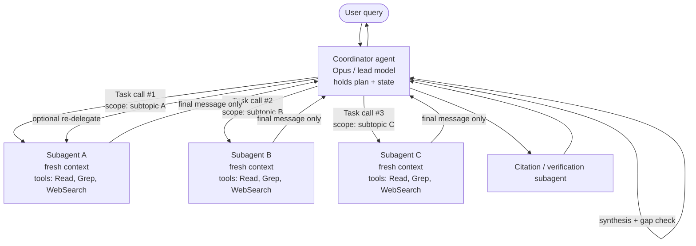

## Что покрывает этот раздел

Как проектировать hub-and-spoke coordinator, который decomposes work, запускает изолированных subagents через `Task`/`Agent` tool, передает полный context в каждом prompt и enforce deterministic prerequisites (hooks, gates), чтобы multi-step workflows чисто передавали работу другим agents или людям без потери state.

## Исходный материал (из официального guide)

### 1.2 Coordinator–subagent patterns

- **Hub-and-spoke architecture**: один coordinator agent управляет всей inter-subagent communication, error handling и information routing.
- **Context isolation**: subagents **не** наследуют conversation history coordinator. Каждый стартует с fresh window.
- **Coordinator responsibilities**: task decomposition, delegation, result aggregation, dynamic selection of which subagents to invoke based on query complexity (а не слепой прогон через full pipeline).
- **Key risk**: overly narrow decomposition. Канонический пример экзамена — запрос про "creative industries", который split into *digital art, graphic design, photography* и silently omits music, writing, and film.
- **Skills tested**: dynamic subagent selection, partitioning scope to minimize duplication, iterative refinement loops (re-delegating when synthesis reveals gaps), routing every call through coordinator for observability.

### 1.3 Subagent invocation & context passing

- **Spawning mechanism**: `Task` tool (renamed `Agent` in Claude Code v2.1.63 — see [SDK note](#a-note-on-task-vs-agent)). Coordinator должен list this tool in `allowedTools`.
- **Explicit context**: subagent context — это все, что вы положили в prompt string. Нет automatic inheritance of parent conversation, tool results или memory.
- **`AgentDefinition`**: per-subagent configuration object containing `description` (when to invoke), `prompt` (system prompt), `tools` / `disallowedTools` (capability restrictions), and optional `model`, `skills`, `mcpServers`, `permissionMode`.
- **`fork_session`**: branches a session into a new one that shares prior history up to a chosen message — используется для divergent exploration from a shared baseline.
- **Skills tested**: passing complete prior findings in spawn prompt, using structured formats (content + metadata: URLs, doc names, page numbers), emitting multiple `Task` calls in **one** coordinator response for parallelism, and writing goal/quality-criteria-style prompts rather than step-by-step procedures.

### 1.4 Workflows with enforcement & handoff

- **Programmatic enforcement (hooks, prerequisite gates)** vs **prompt-based guidance**: когда требуется deterministic compliance (identity verification before a financial transaction), prompts alone have a non-zero failure rate.
- **Structured handoff protocols** for mid-process escalation: customer ID, root-cause analysis, recommended action, evidence trail.
- **Skills tested**: blocking `process_refund` until `get_customer` has returned a verified ID, decomposing multi-concern requests into parallel investigations sharing context, and compiling escalation summaries for humans who lack the transcript.

## Architecture deep-dive

### Hub-and-spoke topology

Coordinator — *единственный* node, который talks to subagents. Subagents никогда не обращаются друг к другу напрямую. Every result returns to the hub, which decides what to do next.



Из этой topology следуют два свойства: **observability** (каждое action flows through one node, значит coordinator-side logging captures full causal graph) и **bounded blast radius** (misbehaving subagent портит только свой context; hub видит только final message и может reject or re-delegate).

Research feature Anthropic использует именно этот pattern: `LeadResearcher` (Opus) планирует, persists plan to memory (200k window can be truncated mid-task), запускает parallel subagents (Sonnet), и передает findings в `CitationAgent`, который re-attributes every claim. Anthropic reports **90.2% lift** over single-agent Claude Opus 4 on internal evals, at **~15× the tokens of a chat** — экономично только когда task value high. ([Anthropic engineering blog](https://www.anthropic.com/engineering/multi-agent-research-system))

### Почему context isolation важен

Window каждого subagent starts fresh. Agent SDK documents the boundary precisely ([Subagents in the SDK](https://code.claude.com/docs/en/agent-sdk/subagents)):

| Subagent получает | Subagent **не** получает |
| --- | --- |
| Свой `AgentDefinition.prompt` | Conversation history или tool results parent |
| String, переданный в `Task`/`Agent` tool call | Parent system prompt |
| Tool definitions (inherited or restricted via `tools`) | Preloaded skills, unless declared in `AgentDefinition.skills` |
| Project `CLAUDE.md` (when `settingSources` is enabled) | Memory, built up by parent across turns |

Три практических следствия: **(1) Compression is the feature** — subagent может read fifty files; parent получает только final message, keeping lead's context clean. **(2) Все, что нужно subagent, должно быть в prompt** — file paths, prior URLs, prior decisions, user constraint "we already ruled out option B." Forward all of it — responsibility of coordinator. **(3) No back-channel** — если subagents need shared state, write it to filesystem or external store and pass references back to coordinator. Anthropic называет это "artifact" pattern; он обходит *game of telephone*, где каждый handoff снижает fidelity.

## Spawning subagents with the Task tool

Coordinator, который может spawn subagents, нуждается в трех вещах: `Task` (или `Agent`) tool in `allowedTools`, one or more `AgentDefinition`s и prompt, который invites delegation. Пример ниже defines two specialized subagents with restricted toolsets and then issues parallel calls from a single coordinator turn.

```typescript
import { query, type AgentDefinition } from "@anthropic-ai/claude-agent-sdk";

const webResearcher: AgentDefinition = {
  description: "Web research specialist. Breadth-first search across the web.",
  prompt: `GOAL: JSON list of {url, title, claim, snippet, retrieved_at}.
QUALITY: prefer primary sources; 5-15 per facet; never invent URLs;
start broad then narrow (don't lead with overly specific queries).`,
  tools: ["WebSearch", "WebFetch", "Read"],
  model: "sonnet",
};

const docAnalyst: AgentDefinition = {
  description: "Document analyst. Extract structured facts from supplied files.",
  prompt: `OUTPUT: JSON list of {source_doc, page, quote, normalized_claim}.
Never paraphrase a number; quote verbatim with its page.`,
  tools: ["Read", "Grep", "Glob"],
  model: "sonnet",
};

for await (const message of query({
  prompt: `Research "the impact of AI on creative industries". Cover full
domain breadth: visual arts AND music AND writing AND film/TV AND performing
arts. Decompose into AT LEAST one subagent per medium and emit the Task calls
in a SINGLE response so they run in parallel. After synthesis, check for
omitted media and re-delegate if any are missing.`,
  options: {
    allowedTools: ["Read", "Grep", "Glob", "WebSearch", "WebFetch", "Task"],
    agents: { "web-researcher": webResearcher, "doc-analyst": docAnalyst },
  },
})) {
  if ("result" in message) console.log(message.result);
}
```

Ключевые пункты, которые проверяет экзамен:

- **`"Task"` (or `"Agent"`) must be in `allowedTools`** on the coordinator, иначе Claude не может spawn anything.
- **Никогда не кладите `Task` / `Agent` в `tools` subagent** — SDK documents this as a hard rule to prevent recursive spawning.
- **Parallelism = multiple tool calls in one assistant turn**, not separate turns. Prompt the lead to "emit the Task calls in a single response." Anthropic reports 3–5 parallel subagents (each making 3+ parallel tool calls) cut research time by up to 90% on complex queries.
- **Prompts specify goals and quality criteria, not procedures.** "Objective + output format + tool guidance + task boundaries" gave Anthropic the largest single quality lift; vague instructions caused duplication and silent gaps.

### `fork_session` для divergent exploration

Когда два subagents должны попробовать *different approaches from the same baseline* — например, одна optimization branch пробует SQL rewrite, а другая index addition — используйте `fork_session`, а не re-spawning from scratch ([Sessions docs](https://code.claude.com/docs/en/agent-sdk/sessions)). Fork copies the conversation up to a chosen message, remaps UUIDs to avoid collisions, and tags each entry with `forkedFrom` for lineage. Each fork resumes independently; original preserved — идеально для A/B exploration без polluting baseline.

### A note on `Task` vs `Agent`

Certification guide называет spawning mechanism **`Task` tool**. SDK renamed it to **`Agent`** in Claude Code v2.1.63. Current SDK releases emit `"Agent"` in new `tool_use` blocks but still emit `"Task"` in `system:init` tools list and `permission_denials[].tool_name`. Для экзамена: treat `Task` as canonical (это wording in the questions). В production 2026 code match **both** names defensively (`block.name in ("Task", "Agent")`).

## Context-passing patterns

Поскольку subagents inherit nothing automatically, задача coordinator — упаковать self-contained briefing в каждый spawn. Principle rewarded by exam: **separate content from metadata, in a structured format, so attribution survives handoff.**

High-quality spawn prompt — structured JSON with content separated from metadata:

```json
{
  "task": "Extend findings on AI's impact on the music industry.",
  "goal": "5-10 sourced 2025-2026 claims on production, distribution, royalties.",
  "prior_findings": [
    {
      "claim": "Major labels sued Suno and Udio in June 2024.",
      "source_url": "https://example.org/riaa-suno-2024",
      "source_title": "RIAA files suit against Suno",
      "retrieved_at": "2026-05-10",
      "confidence": "high"
    },
    {
      "claim": "AI-generated tracks: ~18M streams/day on Deezer in Q1 2025.",
      "source_url": "https://example.org/deezer-q1-2025",
      "page": 14, "retrieved_at": "2026-04-29", "confidence": "medium"
    }
  ],
  "open_questions": ["EU/US 2026 regulatory developments?"],
  "output_format": "list of {claim, source_url, source_title, page?, retrieved_at, confidence}",
  "do_not": ["duplicate prior findings", "rely on a single source for a number", "invent URLs"]
}
```

Почему этот format rewarded: **metadata travels with content** (`source_url`, `page`, `retrieved_at` survive the next hop, так что downstream synthesis agent получает page reference, not paraphrase); **open questions partition the scope**, чтобы subagent не переделывал работу; **explicit "do not" lines** дешевле retries; and **schema is machine-checkable** by coordinator before re-delegation.

## Enforcement: hooks vs prompts

Prompt-based guidance — "always call `get_customer` before `process_refund`" — *probabilistic*. Даже well-tuned Claude 4 model has a non-zero failure rate, unacceptable for financial, security or compliance flows. `PreToolUse` hook turns the rule into a deterministic gate.

```typescript
import { query, type HookCallback, type PreToolUseHookInput } from
  "@anthropic-ai/claude-agent-sdk";

const verifiedCustomers = new Set<string>();

const requireVerifiedCustomer: HookCallback = async (input) => {
  const pre = input as PreToolUseHookInput;
  const args = pre.tool_input as Record<string, unknown>;

  if (pre.tool_name === "get_customer" && args.verified === true) {
    verifiedCustomers.add(String(args.customer_id));
    return {};
  }
  if (pre.tool_name === "process_refund" &&
      !verifiedCustomers.has(String(args.customer_id))) {
    return { hookSpecificOutput: {
      hookEventName: pre.hook_event_name,
      permissionDecision: "deny",
      permissionDecisionReason: "Refund blocked: customer not verified. " +
        "Call get_customer first and obtain a verified ID.",
    }};
  }
  return {};
};

for await (const message of query({
  prompt: "Refund order #88421 for customer C-1042.",
  options: {
    allowedTools: ["get_customer", "process_refund", "Task"],
    hooks: { PreToolUse: [{ matcher: "get_customer|process_refund",
                            hooks: [requireVerifiedCustomer] }] },
  },
})) {
  if ("result" in message) console.log(message.result);
}
```

### Когда что использовать

| Concern | Prompt-based guidance | Programmatic enforcement (hooks / gates) |
| --- | --- | --- |
| Style, tone, formatting | Да — flexible, cheap | Overkill |
| Tool ordering preferences | Да | Только if compliance-bound |
| Identity verification before financial action | **Нет** — non-zero failure rate is unsafe | **Да** — `PreToolUse` deny |
| Writes to protected paths (`.env`, `/etc`) | Нет | Да |
| Audit logging of every tool call | Optional | Да — `PostToolUse` |
| Cross-subagent prerequisites | Нет | Да — hook state across `SubagentStart` / `SubagentStop` |
| Approval routing to a human | Possible but unreliable | Да — `PermissionRequest` / `canUseTool` |

Rule of thumb: **если wrong answer irreversible or regulated, rule belongs in code, not prompt.** Hooks также правильное место, чтобы *normalize* data flowing between subagents (Domain 1.5) — к моменту, когда content reaches downstream agent, it has been schema-checked.

## Handoff to humans

Human agent, который подхватывает escalation, не имеет conversation transcript. Поэтому well-formed handoff summary — часть coordinator contract. Template ниже — то, что exam scenarios reward:

```yaml
handoff:
  type: human_escalation
  reason: policy_exception_required
  urgency: medium
  customer:
    id: C-1042
    verified: true
    verification_method: email_otp
    verified_at: 2026-05-15T14:22:11Z
  case:
    ticket_id: T-58219
    concerns:
      - {type: refund_request, order: O-88421, amount: 249.00, status: blocked_by_policy}
      - {type: account_merge, target: C-0997, status: needs_review}
  root_cause:
    summary: >
      Duplicate charge on O-88421 from a payments retry after a 504. Refund
      automation cannot fire because the duplicate is on a different account
      (C-0997) the customer also owns.
    evidence: [pay_log/2026-05-14T22:14Z#retry-3, orders/O-88421/events#charge-retry]
  attempted_actions:
    - {tool: get_customer, result: verified}
    - {tool: lookup_order, result: duplicate_charge_confirmed}
    - {tool: process_refund, result: blocked,
       blocked_by: prerequisite_gate (cross-account refund needs approval)}
  recommended_action:
    - merge C-1042 and C-0997 (manual review queue)
    - issue refund of 249.00 against the merged account
    - apply goodwill credit of 25.00 per playbook PB-17
  policy_refs: [PB-17, SEC-3]
```

Human needs **identity** (don't re-verify), **case state** (don't redo lookups), **root cause** (don't re-investigate), **attempted actions and why they failed** (don't repeat or undo them), and **recommended action + policy refs** (consistency with prior cases). Та же structure works for subagent-to-subagent escalation.

## Common failure modes (and fixes)

| Failure mode | Symptom | Fix |
| --- | --- | --- |
| **Narrow decomposition** (ловушка "creative industries → only visual arts" из Question 7) | Все subagents successfully complete, но final report silently omits entire domains. Coordinator logs show decomposition was already incomplete. | Coordinator prompt должен требовать **domain-breadth check before delegation** и **gap audit after synthesis** with re-delegation when gaps are found. Tag decomposition with canonical list of subdomains and reject if any are missing. |
| **Over-provisioned subagent** (ловушка Question 9) | Synthesis subagent получил full web-search tools, чтобы не делать round-trip. Solves latency, breaks separation of concerns; synthesis agent теперь also researcher. | Apply least privilege: scope-restricted `verify_fact` tool for the 85% simple-lookup case; keep coordinator-routed delegation for the 15% deep cases. |
| **Sequential where parallel was possible** | Latency scales linearly with subagent count. Coordinator emits one `Task` call, waits, emits the next. | Coordinator prompt must explicitly instruct emitting multiple `Task` calls in a **single response**. Confirm via tracing that assistant turn contained N tool_use blocks. |
| **Missing prerequisite gate** | `process_refund` occasionally fires without a verified customer, especially under prompt drift or model upgrades. | Move the rule into a `PreToolUse` hook that denies downstream tool until a state flag set by prerequisite tool is present. |
| **Lossy handoff to humans** | Human agent re-verifies identity, re-investigates, makes a different decision from the agent's recommendation. | Standardize a structured handoff schema (see above) and validate it at escalation boundary. |
| **Subagent context starvation** | Subagent invents URLs, repeats prior searches, or contradicts prior findings. | Coordinator forgot it must *explicitly* pass prior findings + metadata. Use structured JSON briefings, not paraphrased prose. |
| **Telephone-game decomposition** | Splitting one feature across planner / implementer / tester / reviewer subagents; coordination tokens exceed actual work tokens. | Use **context-centric** decomposition: split by context boundary, not by job title. An agent that owns a feature also owns its tests. Reserve multi-agent for truly parallel, low-coupling work. ([Anthropic guidance](https://claude.com/blog/building-multi-agent-systems-when-and-how-to-use-them)) |
| **Coordinator drift on long runs** | After 100+ turns the lead loses its plan. | Persist the plan to memory at the start (Research-feature pattern); on context pressure, spawn a fresh coordinator with the plan + summary handoff. |

## Exam-style focus points

- **Hub-and-spoke** — default topology; subagents never talk to each other.
- **Subagents inherit nothing** — no conversation, no tool results, no parent system prompt. Pack what they need into the `Task` prompt.
- **`Task` in coordinator's `allowedTools`**, never in subagent's `tools` (recursion).
- **`AgentDefinition`** = `description`, `prompt`, `tools`/`disallowedTools`, plus optional `model`, `skills`, `mcpServers`, `permissionMode`.
- **Parallelism = multiple `Task` calls in one coordinator turn.** Sequential is failure mode.
- **Prompts specify goals and quality criteria**, not procedural steps.
- **Pass prior findings with metadata** (URL, doc, page, retrieval timestamp) in structured form.
- **`fork_session`** = divergent exploration from shared baseline. Not same as parallel decomposition.
- **Hooks > prompts for deterministic compliance.** Identity verification before financial ops belongs in `PreToolUse` hook.
- **Structured handoff** to humans: customer ID, verification status, case state, root cause, attempted actions, recommended action, policy refs.
- **"Creative industries" trap**: all subagents succeed but coverage incomplete → coordinator's *decomposition* is root cause.
- **"Over-provisioned synthesis agent" trap**: scope new tools to 85% case (least privilege); keep coordinator-routed delegation for 15%.
- Multi-agent costs **3–15× more tokens** than single-agent. Justified only for breadth-first, parallelizable, high-value tasks.

## References

- [Anthropic — How we built our multi-agent research system](https://www.anthropic.com/engineering/multi-agent-research-system)
- [Anthropic — When to use multi-agent systems (and when not to)](https://claude.com/blog/building-multi-agent-systems-when-and-how-to-use-them)
- [Claude Agent SDK — Subagents in the SDK](https://code.claude.com/docs/en/agent-sdk/subagents)
- [Claude Agent SDK — Create custom subagents](https://code.claude.com/docs/en/sub-agents)
- [Claude Agent SDK — Work with sessions (incl. `fork_session`)](https://code.claude.com/docs/en/agent-sdk/sessions)
- [Claude Agent SDK — Intercept and control agent behavior with hooks](https://code.claude.com/docs/en/agent-sdk/hooks)
- [Claude Agent SDK — Handle approvals and user input](https://code.claude.com/docs/en/agent-sdk/user-input)
- [Claude Agent SDK — TypeScript reference (`AgentDefinition`)](https://code.claude.com/docs/en/sdk/sdk-typescript)
- [Anthropic cookbook — Agent workflow patterns](https://platform.claude.com/cookbook/patterns-agents-basic-workflows)
