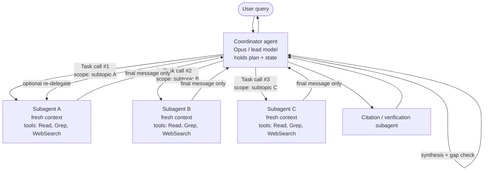

## Что покрывает этот раздел

Как проектировать координатор по схеме hub-and-spoke, который декомпозирует работу, запускает изолированных субагентов через инструмент `Task`/`Agent`, передаёт полный контекст в каждом промпте и обеспечивает детерминированные предусловия (хуки, гейты), чтобы многошаговые рабочие процессы чисто передавали работу другим агентам или людям без потери состояния.

## Исходный материал (из официального руководства)

### 1.2 Паттерны координатор–субагент

- **Архитектура hub-and-spoke**: один координирующий агент управляет всей коммуникацией между субагентами, обработкой ошибок и маршрутизацией информации.
- **Изоляция контекста**: субагенты **не** наследуют историю диалога координатора. Каждый стартует с чистым окном.
- **Обязанности координатора**: декомпозиция задачи, делегирование, агрегация результатов, динамический выбор того, каких субагентов вызывать в зависимости от сложности запроса (а не слепой прогон через весь конвейер).
- **Ключевой риск**: чрезмерно узкая декомпозиция. Канонический пример экзамена — запрос про «creative industries», который разбивается на *digital art, graphic design, photography* и молча опускает music, writing и film.
- **Проверяемые навыки**: динамический выбор субагентов, разбиение области так, чтобы минимизировать дублирование, итеративные циклы доуточнения (повторное делегирование, когда синтез выявляет пробелы), маршрутизация каждого вызова через координатор ради наблюдаемости.

### 1.3 Запуск субагентов и передача контекста

- **Механизм запуска**: инструмент `Task` (переименован в `Agent` в Claude Code v2.1.63 — см. [замечание про SDK](#a-note-on-task-vs-agent)). Координатор обязан указать этот инструмент в `allowedTools`.
- **Явный контекст**: контекст субагента — это то, что вы положили в строку промпта. Никакого автоматического наследования родительского диалога, результатов инструментов или памяти.
- **`AgentDefinition`**: объект конфигурации субагента, содержащий `description` (когда вызывать), `prompt` (системный промпт), `tools` / `disallowedTools` (ограничения возможностей) и опциональные `model`, `skills`, `mcpServers`, `permissionMode`.
- **`fork_session`**: ветвит сессию в новую, которая разделяет предыдущую историю до выбранного сообщения — используется для расходящегося исследования из общей базовой точки.
- **Проверяемые навыки**: передача всех ранее полученных замечаний в стартовом промпте, использование структурированных форматов (контент + метаданные: URL, имена документов, номера страниц), выдача нескольких вызовов `Task` в **одном** ответе координатора ради параллелизма и написание промптов в стиле «цель + критерии качества», а не пошаговых процедур.

### 1.4 Рабочие процессы с принуждением и передачей

- **Программное принуждение (хуки, prerequisite gates)** vs **рекомендации через промпт**: когда нужно детерминированное соблюдение (verификация личности перед финансовой транзакцией), у промптов есть ненулевая вероятность отказа.
- **Структурированные протоколы передачи** при эскалации посреди процесса: ID клиента, анализ корневой причины, рекомендуемое действие, цепочка доказательств.
- **Проверяемые навыки**: блокировка `process_refund`, пока `get_customer` не вернул верифицированный ID, декомпозиция многосоставных запросов в параллельные исследования с общим контекстом и составление сводок для эскалации людям, у которых нет транскрипта.

## Архитектура — глубокое погружение

### Топология hub-and-spoke

Координатор — *единственный* узел, который общается с субагентами. Субагенты никогда не обращаются друг к другу напрямую. Каждый результат возвращается в хаб, который решает, что делать дальше.



Из этой топологии вытекают два свойства: **наблюдаемость** (каждое действие проходит через один узел, поэтому логирование на стороне координатора фиксирует полный причинно-следственный граф) и **ограниченный радиус поражения** (некорректно работающий субагент портит только свой контекст; хаб видит только его финальное сообщение и может отвергнуть его или повторно делегировать).

Функция Research у Anthropic использует именно этот паттерн: `LeadResearcher` (Opus) планирует, фиксирует план в память (окно на 200k токенов может быть усечено посреди задачи), запускает параллельных субагентов (Sonnet) и передаёт замечания в `CitationAgent`, который заново атрибутирует каждое утверждение. Anthropic сообщает о **росте на 90.2%** относительно одиночного Claude Opus 4 на внутренних оценках, при **примерно 15× токенов чата** — экономически оправдано только при высокой ценности задачи. ([Anthropic engineering blog](https://www.anthropic.com/engineering/multi-agent-research-system))

### Почему изоляция контекста важна

Окно каждого субагента стартует с нуля. Agent SDK документирует эту границу точно ([Subagents in the SDK](https://code.claude.com/docs/en/agent-sdk/subagents)):

| Субагент получает | Субагент **не** получает |
| --- | --- |
| Свой `AgentDefinition.prompt` | Историю диалога или результаты инструментов родителя |
| Строку, переданную в вызов инструмента `Task`/`Agent` | Системный промпт родителя |
| Определения инструментов (унаследованные или ограниченные через `tools`) | Преднагруженные навыки, если они не объявлены в `AgentDefinition.skills` |
| Проектный `CLAUDE.md` (когда включён `settingSources`) | Память, которую родитель накопил по ходу ходов |

Три практических следствия: **(1) сжатие — это и есть фича** — субагент может прочитать пятьдесят файлов, а родителю вернётся только его финальное сообщение, оставив контекст ведущего агента чистым. **(2) Всё, что нужно субагенту, обязано быть в промпте** — пути к файлам, прежние URL, прежние решения, ограничение пользователя «we already ruled out option B». Передача всего этого — ответственность координатора. **(3) Никакого обратного канала** — если субагентам нужно общее состояние, пишите его в файловую систему или внешнее хранилище и передавайте обратно координатору ссылки. Anthropic называет это паттерном «artifact»; он обходит *игру в испорченный телефон*, где каждая передача снижает достоверность.

## Запуск субагентов через инструмент Task

Координатору, который умеет запускать субагентов, нужны три вещи: инструмент `Task` (или `Agent`) в `allowedTools`, один или несколько `AgentDefinition` и промпт, приглашающий к делегированию. Пример ниже описывает двух специализированных субагентов с ограниченным набором инструментов и затем выдаёт параллельные вызовы из одного хода координатора.

```typescript
import { query, type AgentDefinition } from "@anthropic-ai/claude-agent-sdk";

const webResearcher: AgentDefinition = {
  description: "Web research specialist. Breadth-first search across the web.",
  prompt: `GOAL: JSON list of {url, title, claim, snippet, retrieved_at}.
QUALITY: prefer primary sources; 5-15 per facet; never invent URLs;
start broad then narrow (don't lead with overly specific queries).`,
  tools: ["WebSearch", "WebFetch", "Read"],
  model: "sonnet",
};

const docAnalyst: AgentDefinition = {
  description: "Document analyst. Extract structured facts from supplied files.",
  prompt: `OUTPUT: JSON list of {source_doc, page, quote, normalized_claim}.
Never paraphrase a number; quote verbatim with its page.`,
  tools: ["Read", "Grep", "Glob"],
  model: "sonnet",
};

for await (const message of query({
  prompt: `Research "the impact of AI on creative industries". Cover full
domain breadth: visual arts AND music AND writing AND film/TV AND performing
arts. Decompose into AT LEAST one subagent per medium and emit the Task calls
in a SINGLE response so they run in parallel. After synthesis, check for
omitted media and re-delegate if any are missing.`,
  options: {
    allowedTools: ["Read", "Grep", "Glob", "WebSearch", "WebFetch", "Task"],
    agents: { "web-researcher": webResearcher, "doc-analyst": docAnalyst },
  },
})) {
  if ("result" in message) console.log(message.result);
}
```

Ключевые пункты, которые проверяет экзамен:

- **`"Task"` (или `"Agent"`) должен быть в `allowedTools`** у координатора, иначе Claude не сможет ничего запустить.
- **Никогда не кладите `Task` / `Agent` в `tools` субагента** — SDK документирует это как жёсткое правило, предотвращающее рекурсивный запуск.
- **Параллелизм = несколько вызовов инструментов в одном ходе ассистента**, а не в разных ходах. Промпт ведущего агента должен явно требовать «emit the Task calls in a single response». Anthropic сообщает, что 3–5 параллельных субагентов (каждый делает 3+ параллельных вызовов инструментов) сокращают время исследования вплоть до 90% на сложных запросах.
- **Промпты задают цели и критерии качества, а не процедуры.** Связка «цель + формат вывода + рекомендации по инструментам + границы задачи» дала Anthropic наибольший единичный прирост качества; расплывчатые инструкции приводили к дублированию и молчаливым пробелам.

### `fork_session` для расходящегося исследования

Когда два субагента должны попробовать *разные подходы из одной и той же базовой точки* — например, одна ветка оптимизации пробует переписать SQL, а другая — добавить индекс — используйте `fork_session`, а не повторный запуск с нуля ([Sessions docs](https://code.claude.com/docs/en/agent-sdk/sessions)). Fork копирует диалог до выбранного сообщения, переназначает UUID во избежание коллизий и помечает каждую запись `forkedFrom` для отслеживания родословной. Каждая ветка возобновляется независимо, оригинал сохраняется — идеально для A/B-исследования без загрязнения базовой ветки.

### Замечание про `Task` vs `Agent`

Сертификационное руководство называет механизм запуска **инструментом `Task`**. SDK переименовал его в **`Agent`** в Claude Code v2.1.63. Текущие релизы SDK выдают `"Agent"` в новых блоках `tool_use`, но всё ещё выдают `"Task"` в списке инструментов `system:init` и в `permission_denials[].tool_name`. Для экзамена считайте `Task` каноническим (именно эта формулировка в вопросах). В продуктовом коде 2026 года защищайтесь от обоих имён (`block.name in ("Task", "Agent")`).

## Паттерны передачи контекста

Поскольку субагенты не наследуют ничего автоматически, задача координатора — упаковать в каждый запуск самодостаточный брифинг. Принцип, который вознаграждает экзамен: **отделять контент от метаданных, в структурированном формате, чтобы атрибуция переживала передачу.**

Качественный стартовый промпт — это структурированный JSON, где контент отделён от метаданных:

```json
{
  "task": "Extend findings on AI's impact on the music industry.",
  "goal": "5-10 sourced 2025-2026 claims on production, distribution, royalties.",
  "prior_findings": [
    {
      "claim": "Major labels sued Suno and Udio in June 2024.",
      "source_url": "https://example.org/riaa-suno-2024",
      "source_title": "RIAA files suit against Suno",
      "retrieved_at": "2026-05-10",
      "confidence": "high"
    },
    {
      "claim": "AI-generated tracks: ~18M streams/day on Deezer in Q1 2025.",
      "source_url": "https://example.org/deezer-q1-2025",
      "page": 14, "retrieved_at": "2026-04-29", "confidence": "medium"
    }
  ],
  "open_questions": ["EU/US 2026 regulatory developments?"],
  "output_format": "list of {claim, source_url, source_title, page?, retrieved_at, confidence}",
  "do_not": ["duplicate prior findings", "rely on a single source for a number", "invent URLs"]
}
```

Почему такой формат поощряется: **метаданные путешествуют вместе с контентом** (`source_url`, `page`, `retrieved_at` переживают следующий переход, поэтому агент синтеза ниже по конвейеру получает ссылку на страницу, а не пересказ); **открытые вопросы разделяют область**, чтобы субагент не переделывал работу; **явные строки «do not»** дешевле повторных попыток; и **схема машинно проверяема** координатором перед повторным делегированием.

## Принуждение: хуки vs промпты

Рекомендация через промпт — «always call `get_customer` before `process_refund`» — *вероятностна*. Даже у хорошо настроенной модели Claude 4 ненулевая частота отказов, что неприемлемо для финансовых, security- и compliance-процессов. Хук `PreToolUse` превращает правило в детерминированный гейт.

```typescript
import { query, type HookCallback, type PreToolUseHookInput } from
  "@anthropic-ai/claude-agent-sdk";

const verifiedCustomers = new Set<string>();

const requireVerifiedCustomer: HookCallback = async (input) => {
  const pre = input as PreToolUseHookInput;
  const args = pre.tool_input as Record<string, unknown>;

  if (pre.tool_name === "get_customer" && args.verified === true) {
    verifiedCustomers.add(String(args.customer_id));
    return {};
  }
  if (pre.tool_name === "process_refund" &&
      !verifiedCustomers.has(String(args.customer_id))) {
    return { hookSpecificOutput: {
      hookEventName: pre.hook_event_name,
      permissionDecision: "deny",
      permissionDecisionReason: "Refund blocked: customer not verified. " +
        "Call get_customer first and obtain a verified ID.",
    }};
  }
  return {};
};

for await (const message of query({
  prompt: "Refund order #88421 for customer C-1042.",
  options: {
    allowedTools: ["get_customer", "process_refund", "Task"],
    hooks: { PreToolUse: [{ matcher: "get_customer|process_refund",
                            hooks: [requireVerifiedCustomer] }] },
  },
})) {
  if ("result" in message) console.log(message.result);
}
```

### Когда что использовать

| Аспект | Рекомендация через промпт | Программное принуждение (хуки / гейты) |
| --- | --- | --- |
| Стиль, тон, форматирование | Да — гибко, дёшево | Избыточно |
| Предпочтения по порядку инструментов | Да | Только если требуется соблюдение compliance |
| Верификация личности перед финансовым действием | **Нет** — ненулевая частота отказов небезопасна | **Да** — `PreToolUse` deny |
| Запись в защищённые пути (`.env`, `/etc`) | Нет | Да |
| Аудит-лог каждого вызова инструмента | Опционально | Да — `PostToolUse` |
| Кросс-субагентные предусловия | Нет | Да — состояние хука между `SubagentStart` / `SubagentStop` |
| Маршрутизация одобрения к человеку | Возможно, но ненадёжно | Да — `PermissionRequest` / `canUseTool` |

Правило большого пальца: **если неверный ответ необратим или регулируется, правило живёт в коде, а не в промпте.** Хуки — также правильное место для *нормализации* данных, протекающих между субагентами (Domain 1.5): к моменту, когда контент достигает агента ниже по конвейеру, он уже проверен по схеме.

## Передача людям

У человека, подхватывающего эскалацию, нет транскрипта диалога. Поэтому хорошо оформленная сводка передачи — часть контракта координатора. Шаблон ниже — то, что вознаграждают экзаменационные сценарии:

```yaml
handoff:
  type: human_escalation
  reason: policy_exception_required
  urgency: medium
  customer:
    id: C-1042
    verified: true
    verification_method: email_otp
    verified_at: 2026-05-15T14:22:11Z
  case:
    ticket_id: T-58219
    concerns:
      - {type: refund_request, order: O-88421, amount: 249.00, status: blocked_by_policy}
      - {type: account_merge, target: C-0997, status: needs_review}
  root_cause:
    summary: >
      Duplicate charge on O-88421 from a payments retry after a 504. Refund
      automation cannot fire because the duplicate is on a different account
      (C-0997) the customer also owns.
    evidence: [pay_log/2026-05-14T22:14Z#retry-3, orders/O-88421/events#charge-retry]
  attempted_actions:
    - {tool: get_customer, result: verified}
    - {tool: lookup_order, result: duplicate_charge_confirmed}
    - {tool: process_refund, result: blocked,
       blocked_by: prerequisite_gate (cross-account refund needs approval)}
  recommended_action:
    - merge C-1042 and C-0997 (manual review queue)
    - issue refund of 249.00 against the merged account
    - apply goodwill credit of 25.00 per playbook PB-17
  policy_refs: [PB-17, SEC-3]
```

Человеку нужны **личность** (не верифицировать заново), **состояние дела** (не повторять поиски), **корневая причина** (не расследовать заново), **попытки и почему они не удались** (не повторять и не откатывать), и **рекомендуемое действие + ссылки на политики** (согласованность с прежними делами). Та же структура работает и для передачи между субагентами.

## Типичные режимы отказа (и их устранение)

| Режим отказа | Симптом | Устранение |
| --- | --- | --- |
| **Узкая декомпозиция** (ловушка «creative industries → only visual arts» из Question 7) | Все субагенты успешно завершаются, но финальный отчёт молча опускает целые области. Логи координатора показывают, что декомпозиция уже была неполной. | Промпт координатора обязан требовать **проверку широты доменов до делегирования** и **аудит пробелов после синтеза** с повторным делегированием при обнаружении пробелов. Помечать декомпозицию каноническим списком поддоменов и отвергать её, если что-то отсутствует. |
| **Слишком широкие полномочия у субагента** (ловушка Question 9) | Агенту синтеза дали полный набор web-search-инструментов, чтобы он не ходил кружным путём. Решает задержку, ломает разделение ответственности; агент синтеза теперь ещё и исследователь. | Применить принцип наименьших привилегий: узкий инструмент `verify_fact` для 85% случаев простой проверки; делегирование через координатор остаётся для 15% сложных случаев. |
| **Последовательно там, где возможно параллельно** | Задержка растёт линейно с числом субагентов. Координатор выдаёт один вызов `Task`, ждёт, выдаёт следующий. | Промпт координатора должен явно требовать выдавать несколько вызовов `Task` в **одном ответе**. Подтверждать трассировкой, что ход ассистента содержал N блоков tool_use. |
| **Отсутствующий prerequisite gate** | `process_refund` иногда срабатывает без верифицированного клиента, особенно при дрейфе промпта или обновлениях модели. | Перенести правило в хук `PreToolUse`, который запрещает нижестоящий инструмент, пока не выставлен флаг состояния от инструмента-предусловия. |
| **Потерянная передача людям** | Человек-агент заново верифицирует личность, заново расследует, принимает иное решение, чем рекомендация агента. | Стандартизировать структурированную схему передачи (см. выше) и валидировать её на границе эскалации. |
| **Голод по контексту у субагента** | Субагент выдумывает URL, повторяет уже сделанные поиски или противоречит ранее найденному. | Координатор забыл, что обязан *явно* передать ранее найденное + метаданные. Используйте структурированные JSON-брифинги, а не пересказанную прозу. |
| **Декомпозиция как испорченный телефон** | Одна фича разрезана между субагентами planner / implementer / tester / reviewer; токенов координации больше, чем токенов фактической работы. | Использовать **контекст-центричную** декомпозицию: делить по границе контекста, а не по должности. Агент, который владеет фичей, владеет и её тестами. Зарезервируйте мультиагента для действительно параллельной, слабо связанной работы. ([Anthropic guidance](https://claude.com/blog/building-multi-agent-systems-when-and-how-to-use-them)) |
| **Дрейф координатора на длинных прогонах** | После 100+ ходов ведущий агент теряет свой план. | Зафиксировать план в память в самом начале (паттерн функции Research); при давлении на контекст запустить свежего координатора с планом + сводкой передачи. |

## Экзаменационные акценты

- **Hub-and-spoke** — топология по умолчанию; субагенты никогда не разговаривают друг с другом.
- **Субагенты не наследуют ничего** — ни диалога, ни результатов инструментов, ни системного промпта родителя. Упакуйте в промпт `Task` то, что им нужно.
- **`Task` в `allowedTools` координатора**, никогда в `tools` субагента (рекурсия).
- **`AgentDefinition`** = `description`, `prompt`, `tools`/`disallowedTools`, плюс опционально `model`, `skills`, `mcpServers`, `permissionMode`.
- **Параллелизм = несколько вызовов `Task` в одном ходе координатора.** Последовательность — это режим отказа.
- **Промпты задают цели и критерии качества**, а не процедурные шаги.
- **Передавайте предыдущие замечания вместе с метаданными** (URL, документ, страница, время извлечения) в структурированном виде.
- **`fork_session`** = расходящееся исследование из общей базовой точки. Это не то же самое, что параллельная декомпозиция.
- **Хуки > промпты для детерминированного соблюдения.** Верификация личности перед финансовыми операциями живёт в хуке `PreToolUse`.
- **Структурированная передача** людям: ID клиента, статус верификации, состояние дела, корневая причина, предпринятые действия, рекомендуемое действие, ссылки на политики.
- **Ловушка «creative industries»**: все субагенты успешны, но покрытие неполное → корневая причина в *декомпозиции* координатора.
- **Ловушка «над-привилегированного агента синтеза»**: проектируйте новые инструменты под 85% случаев (наименьшие привилегии); делегирование через координатор оставляйте для 15%.
- Мультиагент стоит **в 3–15 раз больше токенов**, чем одиночный агент. Оправдан только для задач с широким охватом, поддающихся параллелизации, и высокой ценностью.

## References

- [Anthropic — How we built our multi-agent research system](https://www.anthropic.com/engineering/multi-agent-research-system)
- [Anthropic — When to use multi-agent systems (and when not to)](https://claude.com/blog/building-multi-agent-systems-when-and-how-to-use-them)
- [Claude Agent SDK — Subagents in the SDK](https://code.claude.com/docs/en/agent-sdk/subagents)
- [Claude Agent SDK — Create custom subagents](https://code.claude.com/docs/en/sub-agents)
- [Claude Agent SDK — Work with sessions (incl. `fork_session`)](https://code.claude.com/docs/en/agent-sdk/sessions)
- [Claude Agent SDK — Intercept and control agent behavior with hooks](https://code.claude.com/docs/en/agent-sdk/hooks)
- [Claude Agent SDK — Handle approvals and user input](https://code.claude.com/docs/en/agent-sdk/user-input)
- [Claude Agent SDK — TypeScript reference (`AgentDefinition`)](https://code.claude.com/docs/en/sdk/sdk-typescript)
- [Anthropic cookbook — Agent workflow patterns](https://platform.claude.com/cookbook/patterns-agents-basic-workflows)
