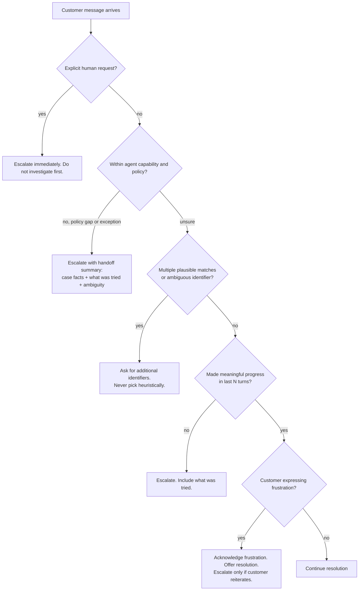

## Qué cubre esta sección

Domain 5 es el dominio más pequeño por peso bruto, pero el más transversal: todos los demás dominios asumen que el agente mantiene claros los hechos críticos, escala en el momento adecuado, expone fallos de forma útil a un coordinador, persiste hallazgos a través de sesiones largas, calibra su propia confianza y preserva de dónde vino cada afirmación. Seis task statements mapean a seis patrones concretos cubiertos abajo. El subdominio de escalación (5.2) evalúa un juicio específico: distinguir los disparadores legítimos de escalación de los dos proxies poco fiables (sentimiento, confianza autoinformada). Sample Question 8 evalúa directamente el contexto estructurado de error.

## Material fuente (de la guía oficial)

### 5.1 Preservación del contexto conversacional

- La summarización progresiva condensa valores numéricos, porcentajes, fechas y expectativas declaradas por el cliente en paráfrasis vagas (`$487.32` → "around five hundred dollars").
- "Lost in the middle": los modelos usan de forma fiable la información al *inicio* y *final* de inputs largos, pero pueden omitir contenido intermedio (Liu et al., reproducido para Claude en la propia guía de long-context de Anthropic).
- Los resultados de herramientas se acumulan de forma desproporcionada a su relevancia (40+ campos por `lookup_order` cuando importan 5).
- El historial conversacional debe pasarse completo en cada turno: la API es stateless y recortar turnos anteriores destruye coherencia silenciosamente.
- Habilidades: extraer hechos transaccionales (montos, fechas, números de orden, estados) en un bloque persistente "case facts" incluido en cada prompt fuera del historial resumido; recortar salidas verbosas de herramientas en el límite; colocar hallazgos clave al inicio de inputs agregados con encabezados explícitos; exigir a subagentes incluir metadatos (fechas, ubicaciones fuente, metodología) en salidas estructuradas; hacer que agentes upstream devuelvan datos estructurados en vez de cadenas verbosas de razonamiento cuando el contexto downstream está limitado.

### 5.2 Escalación y resolución de ambigüedad

- Disparadores legítimos de escalación: solicitud explícita de un humano, excepción o brecha de política (no solo "caso complejo"), incapacidad de avanzar significativamente, ambigüedad multi-match que requiere más identificadores.
- Distinguir **escalación inmediata por demanda explícita** de **ofrecer resolver cuando es sencillo** (reconocer frustración, ofrecer ayuda, escalar solo si se reitera).
- Proxies poco fiables: escalación basada en sentimiento (frustración ≠ complejidad) y confianza autoinformada (los LLMs se equivocan con confianza en los mismos casos difíciles).
- Habilidades: criterios explícitos de escalación con ejemplos few-shot; honrar solicitudes humanas explícitas de inmediato sin investigar primero; escalar ante ambigüedad de política (price-matching de competidor cuando la política solo cubre ajustes del propio sitio); pedir identificadores adicionales en resultados multi-match.

### 5.3 Propagación de errores en sistemas multiagente

- Contexto estructurado de error (tipo de fallo, consulta intentada, resultados parciales, enfoques alternativos) habilita decisiones de recuperación del coordinador.
- Distinguir fallos de acceso (timeout, permiso denegado: candidatos a reintento) de resultados vacíos válidos (consulta exitosa; nada coincidió).
- Estados genéricos como `"search unavailable"` ocultan lo que el coordinador necesita.
- Antipatrones: suprimir errores silenciosamente (devolver vacío como éxito); terminar todo el workflow por un fallo de subagente.
- Habilidades: sobres estructurados de error; distinguir acceso frente a vacío; recuperación local de subagentes para fallos transient con propagación solo de los irrecuperables; salida de síntesis con anotaciones de cobertura que marcan áreas bien soportadas frente a brechas.

### 5.4 Contexto en exploración de codebases grandes

- Degradación de contexto: en sesiones extendidas, los modelos dan respuestas inconsistentes y se refieren a "patrones típicos" en vez de clases específicas descubiertas antes.
- Los archivos scratchpad persisten hallazgos clave a través de límites de contexto.
- La delegación en subagentes aísla exploración verbosa para que el agente principal solo vea resúmenes estructurados.
- Persistencia estructurada de estado (manifests) habilita recuperación ante crash: cada agente exporta estado a una ubicación conocida; el coordinador carga el manifest al reanudar.
- Habilidades: crear subagentes para preguntas específicas ("find all test files," "trace refund-flow dependencies"); mantener archivos scratchpad referenciados para preguntas posteriores; resumir antes de crear la siguiente fase de subagentes; diseñar recuperación ante crash mediante exportaciones de estado estructuradas; usar `/compact` cuando el contexto se llena de salida verbosa de descubrimiento.

### 5.5 Workflows de revisión humana y calibración de confianza

- La precisión agregada (97% global) puede ocultar mal rendimiento en tipos de documento o campos específicos.
- Muestreo aleatorio estratificado del stream de alta confianza revela patrones de error nuevos.
- Scores de confianza a nivel de campo, calibrados contra un validation set etiquetado, enrutan la atención de revisión.
- Valida precisión por tipo de documento y segmento de campo antes de automatizar extracciones de alta confianza.
- Habilidades: muestreo estratificado; precisión por tipo de documento y campo; confianza a nivel de campo con calibración; enrutar items de baja confianza y fuente ambigua a revisión humana; priorizar capacidad limitada de revisores.

### 5.6 Procedencia de información en síntesis multisource

- La atribución de fuente se destruye por summarización salvo que los mapeos claim–source se preserven como datos estructurados.
- Estadísticas conflictivas de fuentes creíbles deben anotarse con ambas atribuciones, no resolverse arbitrariamente.
- Los datos temporales necesitan fechas de publicación/recolección para que diferencias de series temporales no se malinterpreten como contradicciones.
- Habilidades: subagentes producen mapeos estructurados claim–source (URLs, nombres de documentos, excerpts) preservados a través de síntesis; los informes distinguen hallazgos bien establecidos de contestados; valores conflictivos se anotan explícitamente para que el coordinador los reconcilie; fechas de publicación/recolección en cada salida estructurada; renderizar tipos de contenido apropiadamente (financiero como tablas, noticias como prosa, técnico como listas estructuradas) en vez de forzar un formato uniforme.

## Seis patrones de fiabilidad que debes interiorizar

### Patrón 1 — El bloque "case facts"

La summarización progresiva con pérdida es el fallo canónico de Domain 5: el agente convierte turnos previos en un párrafo que pierde el número de orden y la fecha límite del cliente, y el siguiente turno alucina ambos. La corrección es un bloque estructurado, persistente y append-only de hechos transaccionales incluido en *cada* solicitud *fuera* del historial resumido. El bloque solo cambia cuando se añade un nuevo hecho verificado: nunca reformules hechos, nunca dejes que el LLM reescriba el bloque.

```json
{
  "case_facts": {
    "case_id": "C-2026-04891",
    "customer": { "id": "CUS-77342", "verified_via": "get_customer" },
    "orders": [{ "id": "ORD-558102", "status": "delivered", "total_usd": 487.32, "delivered_on": "2026-05-08" }],
    "stated_expectations": [{ "verbatim": "I need the refund by Friday for my wedding", "stated_at_turn": 3 }],
    "policy_decisions": [{ "decision": "manager_approval_required", "reason": "refund > $400", "approved": false }],
    "open_questions": ["Has the item been returned?"]
  }
}
```

Coloca esto al **inicio** del mensaje de usuario en cada turno bajo `## CASE FACTS (authoritative — do not summarize)`. Dos razones: efectos de posición (Liu et al., reproducidos por Anthropic) ponen los tokens iniciales en la región de alta recuperación, y prompt caching mantiene el bloque caliente entre turnos cuando se sitúa antes de contenido volátil. (Guía de prompt caching de Anthropic: el contenido estable debe preceder físicamente al contenido volátil; el orden de render es `tools → system → messages`.)

### Patrón 2 — Recortar salidas de herramientas antes de que se acumulen

Un solo lookup de orden puede devolver 40+ campos. A través de una sesión de 20 turnos, esos campos dominan el contexto. Normaliza salidas de herramientas en el límite del agente a los campos que el razonamiento downstream realmente usa.

Antes:

```json
{ "id": "ORD-558102", "status": "delivered", "shipping_address": {...12 fields...},
  "billing_address": {...12 fields...}, "items": [...20 fields each...],
  "audit_log": [...8 entries...], "internal_flags": {...11 fields...},
  "warehouse_metadata": {...}, "carrier_tracking": [...] }
```

Después (normalización return-flow):

```json
{ "id": "ORD-558102", "status": "delivered", "delivered_on": "2026-05-08",
  "total_usd": 487.32, "items_count": 3, "is_returnable": true }
```

*Writing effective tools for AI agents* y *Effective context engineering for AI agents* de Anthropic llaman a esto "context rot": la precisión se degrada cuando el conteo de tokens raw crece, así que la respuesta es curación, no una ventana más grande. Recorta dentro del wrapper de herramienta: una vez que la salida verbosa está en el historial, no puedes desincluirla retroactivamente.

### Patrón 3 — Contexto estructurado de error

Cuando falla un subagente, devuelve un sobre estructurado, nunca una cadena. Esta es la forma exacta que premia Sample Question 8:

```json
{
  "status": "error",
  "failure_type": "timeout",
  "is_transient": true,
  "agent": "web_search",
  "attempted": { "query": "Q1 2026 generative-music revenue Spotify", "timeout_ms": 30000, "retries": 2 },
  "partial_results": [{ "url": "https://...", "snippet": "..." }],
  "alternatives": [
    "Retry with shorter query 'Spotify generative music revenue 2026'",
    "Delegate to internal_kb_search for analyst notes",
    "Proceed with partial_results and annotate coverage gap"
  ],
  "coverage_gap": "music industry revenue figures incomplete"
}
```

Dos distinciones que el examen evalúa directamente:

- **Fallo de acceso frente a resultado vacío válido.** Timeout, 5xx, error de permiso → `failure_type: "access"`, candidato a reintento. Una consulta exitosa que devolvió cero filas es `status: "ok", results: []`: tratarla como error desperdicia trabajo.
- **Recuperación local frente a propagación.** Los subagentes reintentan fallos transient por sí mismos (uno o dos intentos con backoff). Solo propagan lo que no pueden resolver, siempre con `attempted` y `partial_results`.

En Sample Q8: la opción B "search unavailable after retries" oculta qué se intentó, la opción C marca éxito con vacío y destruye recuperabilidad, la opción D mata subagentes independientes que sí tuvieron éxito. Solo A — el sobre estructurado — da al coordinador información suficiente para recuperarse.

La salida de síntesis refleja esto con **anotaciones de cobertura**:

```json
{
  "well_supported": ["Streaming music revenue grew 14% YoY"],
  "partially_supported": ["Generative-music ARR estimate based on a single analyst note"],
  "gaps": ["Film industry not covered; subagent timed out and was not retried"]
}
```

### Patrón 4 — Scratchpad + manifest para sesiones largas

La exploración de codebases grandes quema contexto rápido: para la séptima pregunta, el modelo se refiere a "typical service patterns" en vez del `BillingService` específico que encontró en el turno 3. Dos capas de defensa:

1. **Archivos scratchpad en disco.** Escribe hallazgos destilados en `.claude/scratch/<topic>.md`. Relee el scratchpad en turnos posteriores. Sobrevive a `/compact` y reinicio de sesión.
2. **Aislamiento de subagente.** Crea un subagente para trabajo verboso y haz que devuelva un resumen de 200 tokens. El agente principal nunca ve los 50K tokens de salida grep.

Un layout típico:

```
.claude/scratch/
├── manifest.json              # coordinator state: phase, completed steps, open questions
├── architecture.md            # one-page distilled findings on the system shape
├── refund-flow.md             # specific subgraph traced by a subagent
├── tests-inventory.md         # output of "find all test files" subagent
└── decisions.md               # ADR-style log of architectural decisions reached so far
```

Un manifest mínimo:

```json
{
  "session_id": "explore-2026-05-15-refunds",
  "phase": "tracing dependencies",
  "completed_steps": ["map services", "inventory tests"],
  "open_questions": ["Does notification service block refund commit?"],
  "scratchpad_files": [
    { "path": ".claude/scratch/architecture.md", "summary_for_resume": "..." },
    { "path": ".claude/scratch/refund-flow.md",  "summary_for_resume": "..." }
  ],
  "subagents": [{ "name": "test-inventory", "status": "complete", "output": ".claude/scratch/tests-inventory.md" }]
}
```

Al reanudar, el coordinador carga `manifest.json`, reinyecta `summary_for_resume` y relee archivos scratchpad solo cuando una pregunta específica lo requiere.

**Cuándo usar `/compact`.** `/compact` de Claude Code resume la conversación preservando tareas en progreso, operaciones de archivo y decisiones arquitectónicas; auto-compact se dispara cerca del 95% de la ventana de 200K por defecto. Usa `/compact` manual *antes* del umbral y *con* preservación explícita: `/compact preserve all file paths, the open questions list, and the manifest path`. Todo lo escrito a scratchpad sobrevive trivialmente a compactación porque vive en disco: eso hace seguro usar `/compact` a mitad de investigación.

### Patrón 5 — Confianza + muestreo estratificado

Autoaprobar todo lo que un modelo 97% preciso está "seguro" oculta dos fallos:

- **El agregado oculta fallos por segmento.** 99.5% en facturas y 65% en contratos promedia bien mientras la pipeline de contratos corrompe datos silenciosamente.
- **El modelo tiene confianza en los casos equivocados.** Las probabilidades raw están mal calibradas; patrones de error nuevos entran al stream de alta confianza sin detectarse.

La corrección tiene tres partes:

1. **Confianza a nivel de campo**, no de documento. `total_amount` puede ser alta mientras `payment_terms` es baja.
2. **Calibración contra un validation set etiquetado.** Agrupa predicciones por confianza raw, mide precisión real por bucket y elige el umbral donde el stream autoaprobado cumple tu presupuesto de error. Recalibra por tipo de documento.
3. **Muestreo aleatorio estratificado del stream de alta confianza.** Enruta ~2% de items autoaprobados a revisión humana, estratificado por tipo de documento y campo, para descubrir errores nuevos.

```
                    ┌─────────────────┐
extracted_records → │ confidence by   │
                    │ field & doctype │
                    └────────┬────────┘
                             │
              ┌──────────────┼──────────────┐
              ▼              ▼              ▼
        low confidence  ambiguous src   high confidence
         → review        → review         → auto-approve
                                          │  ↑
                                          │  │ stratified 2% sample
                                          ▼  │ feeds back into
                                       audit queue
```

Enruta primero items de baja confianza y fuente ambigua a humanos; la cola de muestra-auditoría captura patrones nuevos que escapan al stream autoaprobado. Recalibra cuando se lance un tipo de documento nuevo o cambie el modelo.

### Patrón 6 — Procedencia a través de síntesis

"Summarize what these 12 sources say about X" produce prosa sin enlaces trazables de afirmación a fuente. Exige que los subagentes emitan **mapeos estructurados claim–source** que el paso de síntesis *debe* preservar:

```json
{
  "claims": [
    {
      "claim": "Streaming music revenue grew 14% YoY in Q1 2026",
      "support": [{
        "source_url": "https://example.com/riaa-q1-2026",
        "source_name": "RIAA Q1 2026 report",
        "excerpt": "Total streaming revenue rose 14.0% year-over-year...",
        "publication_date": "2026-04-22"
      }],
      "confidence": "well_supported"
    },
    {
      "claim": "Generative-music tools reduced session-musician hiring",
      "support": [
        { "source_name": "Analyst note A", "value_pct": 9, "publication_date": "2026-03-10" },
        { "source_name": "Analyst note B", "value_pct": 3, "publication_date": "2026-04-02" }
      ],
      "conflict": { "values": [9, 3], "note": "Methodology differs (survey vs payroll)" },
      "confidence": "contested"
    }
  ]
}
```

Tres reglas que el examen espera:

- **Anota conflictos; no elijas.** Cuando fuentes creíbles discrepan, muestra ambas con atribución. Elegir arbitrariamente es el modo de fallo.
- **Siempre lleva fechas.** Una cifra de 2024 y una de 2026 no son contradicciones; son una serie temporal. Sin `publication_date`, la síntesis fabrica contradicciones falsas.
- **Renderiza tipos de contenido apropiadamente.** Financiero → tablas, noticias → prosa, técnico → listas estructuradas. Forzar todo por el mismo sintetizador en prosa destruye la estructura fuente.

*How we built our multi-agent research system* de Anthropic describe esto a escala de producción: subagentes trabajan en paralelo con ventanas de contexto separadas y devuelven hallazgos estructurados al lead agent, que compone el informe final y posee la integridad de citas.

## Árbol de decisión de escalación



Las cuatro rutas legítimas de disparo (E1–E4) mapean a los bullets de conocimiento de 5.2. La ruta de frustración (H) es la trampa: *no* es disparador de escalación por sí sola, y la autoescalación basada en sentimiento es la respuesta incorrecta canónica en Sample Question 3.

## Antipatrones que memorizar

- **Autoescalación basada en sentimiento.** Frustración ≠ complejidad.
- **Confianza autoinformada como señal de enrutamiento.** El agente se equivoca con confianza en los mismos casos que más quieres escalar.
- **Errores genéricos `"operation failed"`.** Eliminan tipo de fallo, consulta intentada y resultados parciales que el coordinador podría haber usado.
- **Resultado vacío devuelto como éxito cuando la llamada realmente falló.** Corrupción silenciosa de datos: el coordinador cree que nada coincidió cuando la búsqueda nunca se ejecutó.
- **Terminar el workflow por un solo fallo de subagente.** Descarta subagentes independientes que sí tuvieron éxito.
- **97% de precisión agregada sin desglose por segmento.** Oculta que un tipo de documento colapsa mientras otros siguen sanos.
- **Resumir afirmaciones sin preservar mapeo claim → source.** Una vez perdido no puedes reconstruirlo; solo volver a buscar.
- **Dejar que un resumen rolling reescriba números, fechas o citas textuales.** Fíjalos en un bloque case-facts intocable.
- **Enterrar hallazgos importantes en medio de un input largo.** Lost-in-the-middle es real; pon hallazgos críticos al inicio con encabezado.
- **Tratar `@import` o un CLAUDE.md gigante como optimización de contexto.** Expanden contexto. Usa scratchpads + aislamiento de subagentes + reglas con alcance de ruta.

## Integración transversal con otros dominios

- **Scenario 1 (Customer Support, Q1–3).** Question 3 evalúa directamente calibración de escalación 5.2. El patrón "case facts" también es la respuesta correcta a casi cualquier pregunta sobre cuentas mal identificadas o detalles perdidos en conversaciones largas. La pregunta 1 sobre prerrequisito programático para `get_customer` encaja naturalmente con el bloque case-facts: un hook impone verificación y el ID verificado aterriza en el bloque case-facts donde las herramientas downstream confían en él.
- **Scenario 3 (Multi-Agent Research, Q7–9).** Question 8 *es* el patrón 3 de esta sección. Question 9 (herramienta `verify_fact` acotada para síntesis) presupone el patrón de procedencia 5.6: no puedes verificar lo que no puedes trazar hasta una fuente. La práctica "lead agent saves plan to memory" del blog de investigación multiagente de Anthropic es el patrón manifest 5.4 en producción.
- **Scenario 2 / Code Generation (Q4–6).** Las sesiones largas de exploración de codebase sufren degradación de contexto de inmediato; la tríada scratchpad + subagente + `/compact` de 5.4 es la respuesta práctica, combinada con reglas de ruta y guía modular CLAUDE.md de la Sección 7.

Todos los demás dominios asumen que el agente es *fiable*. Domain 5 es lo que hace que esa suposición se sostenga en producción.

## Puntos de enfoque para el examen

- Cuatro disparadores legítimos de escalación: solicitud humana explícita, excepción/brecha de política, incapacidad de avanzar, ambigüedad multi-match. Dos proxies poco fiables: sentimiento, confianza autoinformada.
- Forma del sobre estructurado de error (sample Q8): `failure_type`, `attempted`, `partial_results`, `alternatives`. Esa forma exacta es la respuesta correcta cuando un subagente hace timeout.
- **Fallo de acceso** (candidato a reintento) frente a **resultado vacío válido** (sin reintento).
- Summarización con pérdida → "bloque case facts, incluido en cada turno, fuera del resumen."
- Salidas de herramientas de 40+ campos → "recortar en el wrapper de herramienta a los campos que downstream usa."
- Sesión larga de codebase donde "el modelo se refiere a patrones típicos" → "archivos scratchpad + subagentes." `/compact` es la palanca de mitad de sesión.
- 97% de precisión agregada **no** basta para autoaprobar hasta tener precisión por tipo de documento y por campo más auditoría por muestra estratificada en el stream de alta confianza.
- La confianza autoinformada del LLM está mal calibrada. Calibra contra un validation set etiquetado.
- Estadísticas conflictivas en síntesis → anotar ambas con fuentes, nunca elegir. Exigir siempre fechas.
- Lost-in-the-middle aplica también a Claude; coloca hallazgos clave al inicio de inputs largos con encabezados explícitos.
- `/compact` preserva tareas en progreso, rutas de archivo y decisiones arquitectónicas, pero pierde salida detallada de herramientas; combínalo con scratchpads en disco.
- Prompt caching necesita contenido estable antes de contenido volátil (`tools → system → messages`). El bloque case-facts es un objetivo perfecto de caché *si se añade, no se reescribe*.

## Referencias

- Anthropic, *Effective context engineering for AI agents* — [anthropic.com/engineering/effective-context-engineering-for-ai-agents](https://www.anthropic.com/engineering/effective-context-engineering-for-ai-agents)
- Anthropic, *Writing effective tools for AI agents* — [anthropic.com/engineering/writing-tools-for-agents](https://www.anthropic.com/engineering/writing-tools-for-agents)
- Anthropic, *How we built our multi-agent research system* — [anthropic.com/engineering/multi-agent-research-system](https://www.anthropic.com/engineering/multi-agent-research-system)
- Anthropic, *Building effective agents* — [anthropic.com/engineering/building-effective-agents](https://www.anthropic.com/engineering/building-effective-agents)
- Anthropic, *Prompting best practices for long context* — [docs.anthropic.com/en/docs/build-with-claude/prompt-engineering/long-context-tips](https://docs.anthropic.com/en/docs/build-with-claude/prompt-engineering/long-context-tips)
- Anthropic, *Context windows* — [docs.anthropic.com/en/docs/build-with-claude/context-windows](https://docs.anthropic.com/en/docs/build-with-claude/context-windows)
- Anthropic, *Prompt caching* — [docs.anthropic.com/en/docs/build-with-claude/prompt-caching](https://docs.anthropic.com/en/docs/build-with-claude/prompt-caching)
- Anthropic, *Prompt engineering for Claude's long context window* — [anthropic.com/news/prompting-long-context](https://www.anthropic.com/news/prompting-long-context)
- Anthropic, *Memory tool* — [docs.anthropic.com/en/docs/agents-and-tools/tool-use/memory-tool](https://docs.anthropic.com/en/docs/agents-and-tools/tool-use/memory-tool)
- Anthropic, *Using agent memory (Managed Agents)* — [platform.claude.com/docs/en/managed-agents/memory](https://platform.claude.com/docs/en/managed-agents/memory)
- Anthropic, *Persist sessions to external storage* — [code.claude.com/docs/en/agent-sdk/session-storage](https://code.claude.com/docs/en/agent-sdk/session-storage)
- Anthropic, *Rewind file changes with checkpointing* — [code.claude.com/docs/en/agent-sdk/file-checkpointing](https://code.claude.com/docs/en/agent-sdk/file-checkpointing)
- Liu et al., *Lost in the Middle: How Language Models Use Long Contexts*, TACL 2024 — [arxiv.org/abs/2307.03172](https://arxiv.org/abs/2307.03172)
