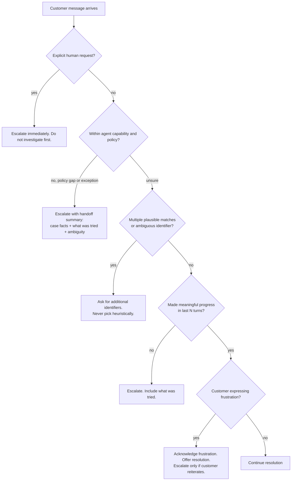

## Ce que couvre cette section

Le Domaine 5 est le plus petit par poids brut mais le plus transversal : tous les autres domaines supposent que l'agent garde les faits critiques exacts, escalade au bon moment, remonte les échecs de manière utile à un coordinateur, persiste ses découvertes sur de longues sessions, calibre sa propre confiance et préserve l'origine de chaque affirmation. Six énoncés de tâches correspondent aux six modèles concrets ci-dessous. Le sous-domaine escalade (5.2) teste un jugement précis : distinguer les déclencheurs légitimes d'escalade des deux proxies peu fiables (sentiment, confiance auto-déclarée). La Sample Question 8 teste directement le contexte d'erreur structuré.

## Source (guide officiel)

### 5.1 Préservation du contexte conversationnel

- La synthèse progressive condense les valeurs numériques, pourcentages, dates et attentes exprimées par le client en paraphrases vagues (`$487.32` → "around five hundred dollars").
- "Lost in the middle" : les modèles utilisent de manière fiable les informations au *début* et à la *fin* des longs inputs, mais peuvent omettre le contenu du milieu (Liu et al., reproduit pour Claude dans les propres recommandations long-contexte d'Anthropic).
- Les résultats d'outils s'accumulent de façon disproportionnée à leur pertinence (40+ champs par `lookup_order` quand 5 comptent).
- L'historique de conversation doit être transmis en entier à chaque tour — l'API est stateless et supprimer les premiers tours détruit silencieusement la cohérence.
- Compétences : extraire les faits transactionnels (montants, dates, numéros de commande, statuts) dans un bloc persistant "case facts" inclus dans chaque prompt hors historique résumé ; réduire les sorties d'outils verbeuses à la frontière ; placer les conclusions clés au début des entrées agrégées avec des en-têtes explicites ; exiger des subagents qu'ils incluent des métadonnées (dates, emplacements de source, méthodologie) dans des sorties structurées ; faire renvoyer aux agents amont des données structurées plutôt que des chaînes de raisonnement verbeuses quand le contexte aval est contraint.

### 5.2 Escalade et résolution de l'ambiguïté

- Déclencheurs légitimes d'escalade : demande explicite du client pour un humain, exception ou lacune de politique (pas seulement "cas complexe"), incapacité à faire un progrès significatif, ambiguïté multi-match nécessitant plus d'identifiants.
- Distinguer l'**escalade immédiate sur demande explicite** de l'**offre de résolution quand le cas est simple** (reconnaître la frustration, proposer de l'aide, escalader seulement si le client réitère).
- Proxies peu fiables : escalade basée sur le sentiment (frustration ≠ complexité) et confiance auto-déclarée (les LLM sont confiants sur les mêmes cas difficiles où ils se trompent).
- Compétences : critères d'escalade explicites avec few-shot examples ; honorer les demandes explicites d'humain immédiatement sans enquêter d'abord ; escalader en cas d'ambiguïté de politique (alignement de prix concurrent quand la politique ne couvre que les ajustements sur son propre site) ; demander des identifiants supplémentaires en cas de résultats multi-match.

### 5.3 Propagation d'erreurs dans les systèmes multi-agents

- Un contexte d'erreur structuré (type d'échec, requête tentée, résultats partiels, approches alternatives) permet au coordinateur de décider de la récupération.
- Distinguer les échecs d'accès (timeout, permission denied — candidats au retry) des résultats vides valides (requête réussie ; aucune correspondance).
- Les statuts génériques comme `"search unavailable"` cachent ce dont le coordinateur a besoin.
- Anti-patterns : supprimer silencieusement les erreurs (retourner vide comme succès) ; terminer tout le workflow à cause d'un seul échec de subagent.
- Compétences : enveloppes d'erreur structurées ; distinction accès vs vide ; récupération locale par le subagent pour les échecs transitoires avec propagation seulement des échecs irrécupérables ; sortie de synthèse avec annotations de couverture indiquant les zones bien étayées vs les lacunes.

### 5.4 Contexte dans l'exploration de grands codebases

- Dégradation du contexte : dans les sessions longues, les modèles donnent des réponses incohérentes et font référence à des "patterns typiques" plutôt qu'aux classes spécifiques découvertes plus tôt.
- Les fichiers scratchpad persistent les découvertes clés à travers les frontières de contexte.
- La délégation à des subagents isole l'exploration verbeuse afin que l'agent principal ne voie que des résumés structurés.
- La persistance structurée d'état (manifests) permet la reprise après crash : chaque agent exporte son état vers un emplacement connu ; le coordinateur charge le manifest à la reprise.
- Compétences : lancer des subagents pour des questions spécifiques ("find all test files", "trace refund-flow dependencies") ; maintenir des fichiers scratchpad référencés pour les questions suivantes ; résumer avant de lancer la phase suivante de subagents ; concevoir une reprise après crash via exports structurés d'état agent ; utiliser `/compact` quand le contexte se remplit de sorties d'exploration verbeuses.

### 5.5 Workflows de revue humaine et calibration de confiance

- Une exactitude agrégée (97 % global) peut masquer une mauvaise performance sur certains types de documents ou champs.
- L'échantillonnage aléatoire stratifié du flux haute confiance révèle de nouveaux motifs d'erreur.
- Des scores de confiance au niveau champ, calibrés sur un jeu de validation annoté, routent l'attention des reviewers.
- Valider l'exactitude par type de document et segment de champ avant d'automatiser les extractions haute confiance.
- Compétences : échantillonnage stratifié ; exactitude par type de document et champ ; confiance au niveau champ avec calibration ; router les items basse confiance et source ambiguë vers la revue humaine ; prioriser une capacité reviewer limitée.

### 5.6 Provenance de l'information en synthèse multi-source

- L'attribution des sources est détruite par la synthèse sauf si les mappings claim–source sont préservés comme données structurées.
- Les statistiques contradictoires provenant de sources crédibles doivent être annotées avec les deux attributions, pas résolues arbitrairement.
- Les données temporelles ont besoin de dates de publication/collecte pour que les différences de séries temporelles ne soient pas mal interprétées comme contradictions.
- Compétences : subagents produisant des mappings claim–source structurés (URLs, noms de documents, extraits) préservés pendant la synthèse ; rapports distinguant les conclusions bien établies des conclusions contestées ; valeurs contradictoires explicitement annotées pour que le coordinateur les réconcilie ; dates de publication/collecte dans chaque sortie structurée ; rendu approprié au type de contenu (financier en tableaux, actualités en prose, technique en listes structurées) au lieu de forcer un format uniforme.

## Six modèles de fiabilité à internaliser

### Modèle 1 — Le bloc "case facts"

La synthèse progressive avec perte est l'échec canonique du Domaine 5 : l'agent résume les premiers tours dans un paragraphe qui perd le numéro de commande et la date limite du client, puis hallucine les deux au tour suivant. Le correctif est un bloc transactionnel séparé, structuré, append-only, inclus dans *chaque* requête *en dehors* de l'historique résumé. Le bloc ne change que lorsqu'un nouveau fait vérifié est ajouté — ne jamais reformuler les faits, ne jamais laisser le LLM réécrire le bloc.

```json
{
  "case_facts": {
    "case_id": "C-2026-04891",
    "customer": { "id": "CUS-77342", "verified_via": "get_customer" },
    "orders": [{ "id": "ORD-558102", "status": "delivered", "total_usd": 487.32, "delivered_on": "2026-05-08" }],
    "stated_expectations": [{ "verbatim": "I need the refund by Friday for my wedding", "stated_at_turn": 3 }],
    "policy_decisions": [{ "decision": "manager_approval_required", "reason": "refund > $400", "approved": false }],
    "open_questions": ["Has the item been returned?"]
  }
}
```

Placez-le au **début** du message utilisateur à chaque tour sous `## CASE FACTS (authoritative — do not summarize)`. Deux raisons : les effets de position (Liu et al., reproduits par Anthropic) placent les tokens de début de contexte dans la zone de meilleur rappel, et le prompt caching garde ce bloc chaud entre les tours quand il précède tout contenu volatil. (Recommandation prompt caching d'Anthropic : le contenu stable doit physiquement précéder le contenu volatil ; l'ordre de rendu est `tools → system → messages`.)

### Modèle 2 — Réduire les sorties d'outils avant qu'elles ne s'accumulent

Un seul lookup de commande peut renvoyer 40+ champs. Sur une session de 20 tours, ces champs dominent le contexte. Normalisez les sorties d'outils à la frontière agent vers les champs dont le raisonnement aval a réellement besoin.

Avant :

```json
{ "id": "ORD-558102", "status": "delivered", "shipping_address": {...12 fields...},
  "billing_address": {...12 fields...}, "items": [...20 fields each...],
  "audit_log": [...8 entries...], "internal_flags": {...11 fields...},
  "warehouse_metadata": {...}, "carrier_tracking": [...] }
```

Après (normalisation du flux de retour) :

```json
{ "id": "ORD-558102", "status": "delivered", "delivered_on": "2026-05-08",
  "total_usd": 487.32, "items_count": 3, "is_returnable": true }
```

Les articles d'Anthropic *Writing effective tools for AI agents* et *Effective context engineering for AI agents* appellent cela "context rot" : l'exactitude se dégrade quand le nombre brut de tokens augmente, donc la réponse est la curation, pas une fenêtre plus grande. Réduisez dans le wrapper d'outil — une fois la sortie verbeuse dans l'historique, vous ne pouvez pas l'en retirer rétroactivement.

### Modèle 3 — Contexte d'erreur structuré

Quand un subagent échoue, renvoyez une enveloppe structurée, jamais une chaîne. C'est exactement la forme récompensée par la Sample Question 8 :

```json
{
  "status": "error",
  "failure_type": "timeout",
  "is_transient": true,
  "agent": "web_search",
  "attempted": { "query": "Q1 2026 generative-music revenue Spotify", "timeout_ms": 30000, "retries": 2 },
  "partial_results": [{ "url": "https://...", "snippet": "..." }],
  "alternatives": [
    "Retry with shorter query 'Spotify generative music revenue 2026'",
    "Delegate to internal_kb_search for analyst notes",
    "Proceed with partial_results and annotate coverage gap"
  ],
  "coverage_gap": "music industry revenue figures incomplete"
}
```

Deux distinctions que l'examen teste directement :

- **Échec d'accès vs résultat vide valide.** Timeout, 5xx, erreur de permission → `failure_type: "access"`, candidat au retry. Une requête réussie qui renvoie zéro ligne est `status: "ok", results: []` — la traiter comme une erreur gaspille du travail.
- **Récupération locale vs propagation.** Les subagents réessaient eux-mêmes les échecs transitoires (une ou deux tentatives avec backoff). Ils ne propagent que ce qu'ils ne peuvent pas résoudre, toujours avec `attempted` et `partial_results`.

Dans la sample Q8 : l'option B "search unavailable after retries" cache ce qui a été tenté, l'option C vide-mais-marqué-succès détruit la récupérabilité, l'option D tue les subagents indépendants qui ont réussi. Seule A — l'enveloppe structurée — donne au coordinateur assez d'information pour récupérer.

La sortie de synthèse reflète cela avec des **annotations de couverture** :

```json
{
  "well_supported": ["Streaming music revenue grew 14% YoY"],
  "partially_supported": ["Generative-music ARR estimate based on a single analyst note"],
  "gaps": ["Film industry not covered; subagent timed out and was not retried"]
}
```

### Modèle 4 — Scratchpad + manifest pour les longues sessions

L'exploration de grands codebases consomme vite le contexte — à la septième question, le modèle parle de "patterns de service typiques" plutôt que du `BillingService` spécifique trouvé au tour 3. Deux défenses :

1. **Fichiers scratchpad sur disque.** Écrire les découvertes distillées dans `.claude/scratch/<topic>.md`. Relire le scratchpad aux tours suivants. Survit à `/compact` et au redémarrage de session.
2. **Isolation par subagent.** Lancer un subagent pour le travail verbeux et lui faire renvoyer un résumé de 200 tokens. L'agent principal ne voit jamais les 50K tokens de sortie grep.

Disposition typique :

```
.claude/scratch/
├── manifest.json              # coordinator state: phase, completed steps, open questions
├── architecture.md            # one-page distilled findings on the system shape
├── refund-flow.md             # specific subgraph traced by a subagent
├── tests-inventory.md         # output of "find all test files" subagent
└── decisions.md               # ADR-style log of architectural decisions reached so far
```

Manifest minimal :

```json
{
  "session_id": "explore-2026-05-15-refunds",
  "phase": "tracing dependencies",
  "completed_steps": ["map services", "inventory tests"],
  "open_questions": ["Does notification service block refund commit?"],
  "scratchpad_files": [
    { "path": ".claude/scratch/architecture.md", "summary_for_resume": "..." },
    { "path": ".claude/scratch/refund-flow.md",  "summary_for_resume": "..." }
  ],
  "subagents": [{ "name": "test-inventory", "status": "complete", "output": ".claude/scratch/tests-inventory.md" }]
}
```

À la reprise, le coordinateur charge `manifest.json`, réinjecte `summary_for_resume`, et relit les fichiers scratchpad seulement lorsqu'une question précise l'exige.

**Quand utiliser `/compact`.** Le `/compact` de Claude Code résume la conversation tout en préservant les tâches en cours, opérations fichier et décisions d'architecture ; l'auto-compact se déclenche par défaut près de 95 % de la fenêtre 200K. Utilisez `/compact` manuellement *avant* le seuil et *avec* une consigne de préservation explicite : `/compact preserve all file paths, the open questions list, and the manifest path`. Tout ce qui est déjà écrit dans un scratchpad survit trivialement à la compaction parce que cela vit sur disque — c'est ce qui rend `/compact` sûr en milieu d'investigation.

### Modèle 5 — Confiance + échantillonnage stratifié

Auto-approuver tout ce dont un modèle exact à 97 % est "sûr" cache deux échecs :

- **L'agrégat masque l'échec par segment.** 99,5 % sur les factures et 65 % sur les contrats donnent une moyenne correcte pendant que le pipeline contrats corrompt silencieusement des données.
- **Le modèle est confiant sur les mauvais cas.** Les probabilités brutes sont mal calibrées ; de nouveaux motifs d'erreur entrent dans le flux haute confiance sans détection.

Le correctif a trois parties :

1. **Confiance au niveau champ**, pas au niveau document. `total_amount` peut être high tandis que `payment_terms` est low.
2. **Calibration sur un jeu de validation annoté.** Regrouper les prédictions par confiance brute, mesurer l'exactitude réelle par groupe, et choisir le seuil où le flux auto-approuvé respecte votre budget d'erreur. Recalibrer par type de document.
3. **Échantillonnage aléatoire stratifié du flux haute confiance.** Router environ 2 % des items auto-approuvés vers revue humaine, stratifiés par type de document et champ, pour découvrir de nouveaux motifs d'erreur.

```
                    ┌─────────────────┐
extracted_records → │ confidence by   │
                    │ field & doctype │
                    └────────┬────────┘
                             │
              ┌──────────────┼──────────────┐
              ▼              ▼              ▼
        low confidence  ambiguous src   high confidence
         → review        → review         → auto-approve
                                          │  ↑
                                          │  │ stratified 2% sample
                                          ▼  │ feeds back into
                                       audit queue
```

Routez d'abord vers l'humain les items basse confiance et source ambiguë ; la file d'audit par échantillon attrape les nouveaux patterns qui échappent au flux auto-approuvé. Recalibrez quand un nouveau type de document arrive ou quand le modèle change.

### Modèle 6 — Provenance à travers la synthèse

"Résume ce que ces 12 sources disent de X" produit une prose sans liens traçables entre affirmation et source. Exigez que les subagents émettent des **mappings claim–source structurés** que l'étape de synthèse *doit* préserver :

```json
{
  "claims": [
    {
      "claim": "Streaming music revenue grew 14% YoY in Q1 2026",
      "support": [{
        "source_url": "https://example.com/riaa-q1-2026",
        "source_name": "RIAA Q1 2026 report",
        "excerpt": "Total streaming revenue rose 14.0% year-over-year...",
        "publication_date": "2026-04-22"
      }],
      "confidence": "well_supported"
    },
    {
      "claim": "Generative-music tools reduced session-musician hiring",
      "support": [
        { "source_name": "Analyst note A", "value_pct": 9, "publication_date": "2026-03-10" },
        { "source_name": "Analyst note B", "value_pct": 3, "publication_date": "2026-04-02" }
      ],
      "conflict": { "values": [9, 3], "note": "Methodology differs (survey vs payroll)" },
      "confidence": "contested"
    }
  ]
}
```

Trois règles attendues à l'examen :

- **Annoter les conflits ; ne pas choisir arbitrairement.** Quand des sources crédibles divergent, exposez les deux avec attribution. La sélection arbitraire est le mode d'échec.
- **Toujours porter les dates.** Un chiffre 2024 et un chiffre 2026 ne sont pas des contradictions ; ce sont une série temporelle. Sans `publication_date`, la synthèse invente de fausses contradictions.
- **Rendre les types de contenu de manière appropriée.** Financier → tableaux, actualités → prose, technique → listes structurées. Forcer tout à passer par le même synthétiseur en prose détruit la structure des sources.

L'article d'Anthropic *How we built our multi-agent research system* décrit cela à l'échelle production : les subagents travaillent en parallèle dans des fenêtres de contexte séparées, renvoient des conclusions structurées au lead agent, qui compose le rapport final et possède l'intégrité des citations.

## Arbre de décision d'escalade



Les quatre voies légitimes de déclenchement (E1–E4) correspondent aux points de connaissance de 5.2. La voie frustration (H) est le piège — *pas* un déclencheur d'escalade à elle seule, et l'auto-escalade basée sur le sentiment est la mauvaise réponse canonique de la Sample Question 3.

## Anti-patterns à mémoriser

- **Auto-escalade basée sur le sentiment.** Frustration ≠ complexité.
- **Confiance auto-déclarée comme signal de routage.** L'agent est confiant sur les mêmes cas où il se trompe le plus.
- **Erreurs génériques `"operation failed"`.** Elles suppriment le type d'échec, la requête tentée et les résultats partiels que le coordinateur aurait pu utiliser.
- **Résultat vide renvoyé comme succès alors que l'appel a échoué.** Corruption silencieuse des données — le coordinateur croit qu'aucune correspondance n'existe alors que la recherche n'a jamais tourné.
- **Terminer le workflow sur un seul échec de subagent.** Jette les résultats des subagents indépendants qui ont réussi.
- **97 % d'exactitude agrégée sans ventilation par segment.** Cache l'effondrement d'un type de document pendant que les autres restent sains.
- **Résumer des affirmations sans préserver le mapping claim → source.** Une fois perdu, vous ne pouvez pas le reconstruire ; vous ne pouvez que refaire la recherche.
- **Laisser un résumé glissant réécrire les nombres, dates ou citations verbatim.** Épinglez-les dans un bloc case-facts intouchable.
- **Enterrer les conclusions importantes au milieu d'un long input.** Lost-in-the-middle est réel ; placez les éléments critiques au début avec un en-tête explicite.
- **Traiter `@import` ou un énorme CLAUDE.md comme une optimisation de contexte.** Ils étendent le contexte. Utilisez scratchpads + isolation subagent + règles path-scoped.

## Intégration transversale avec les autres domaines

- **Scénario 1 (Customer Support, Q1–3).** La question 3 teste directement la calibration d'escalade 5.2. Le modèle "case facts" est aussi la bonne réponse à presque toute question sur des comptes mal identifiés ou des détails perdus dans de longues conversations. Le prérequis programmatique de la question 1 pour `get_customer` se combine naturellement avec le bloc case-facts : un hook impose la vérification, et l'ID vérifié atterrit dans le bloc case-facts où les outils aval s'appuient dessus.
- **Scénario 3 (Multi-Agent Research, Q7–9).** La question 8 *est* le Modèle 3 de cette section. La question 9 (outil `verify_fact` scopé pour la synthèse) suppose le modèle de provenance 5.6 — vous ne pouvez pas vérifier ce que vous ne pouvez pas retracer à une source. La pratique "lead agent saves plan to memory" du blog recherche multi-agent d'Anthropic est le modèle manifest de 5.4 en production.
- **Scénario 2 / Code Generation (Q4–6).** Les longues sessions d'exploration de codebase frappent immédiatement la dégradation de contexte ; le trio scratchpad + subagent + `/compact` de 5.4 est la réponse pratique, combinée aux règles path-scoped et aux recommandations de modularisation CLAUDE.md de la Section 7.

Tous les autres domaines supposent que l'agent est *fiable*. Le Domaine 5 est ce qui rend cette hypothèse vraie en production.

## Points d'attention pour l'examen

- Quatre déclencheurs légitimes d'escalade : demande explicite d'un humain, exception/lacune de politique, incapacité à progresser, ambiguïté multi-match. Deux proxies peu fiables : sentiment, confiance auto-déclarée.
- Forme d'enveloppe d'erreur structurée (sample Q8) : `failure_type`, `attempted`, `partial_results`, `alternatives`. Cette forme exacte est la bonne réponse quand un subagent time out.
- **Échec d'accès** (candidat au retry) vs **résultat vide valide** (pas de retry).
- Synthèse avec perte → "bloc case facts, inclus à chaque tour, hors résumé".
- Sorties d'outils à 40+ champs → "réduire au wrapper d'outil aux champs utilisés par l'aval".
- Longue session codebase où "le modèle parle de patterns typiques" → "fichiers scratchpad + subagents". `/compact` est le levier de milieu de session.
- 97 % d'exactitude agrégée ne suffit *pas* à auto-approuver tant que vous n'avez pas l'exactitude par type de document, par champ, plus un audit par échantillon stratifié du flux haute confiance.
- La confiance auto-déclarée du LLM est mal calibrée. Calibrez sur un jeu de validation annoté.
- Statistiques contradictoires en synthèse → annoter les deux avec sources, ne jamais choisir arbitrairement. Toujours exiger les dates.
- Lost-in-the-middle s'applique aussi à Claude ; placez les conclusions clés au début des longs inputs avec des en-têtes explicites.
- `/compact` préserve les tâches en cours, chemins de fichiers et décisions d'architecture mais perd les détails des sorties d'outils ; associez-le à des scratchpads sur disque.
- Le prompt caching exige le contenu stable avant le contenu volatil (`tools → system → messages`). Le bloc case-facts est une cible de cache parfaite *s'il est ajouté, pas réécrit*.

## Références

- Anthropic, *Effective context engineering for AI agents* — [anthropic.com/engineering/effective-context-engineering-for-ai-agents](https://www.anthropic.com/engineering/effective-context-engineering-for-ai-agents)
- Anthropic, *Writing effective tools for AI agents* — [anthropic.com/engineering/writing-tools-for-agents](https://www.anthropic.com/engineering/writing-tools-for-agents)
- Anthropic, *How we built our multi-agent research system* — [anthropic.com/engineering/multi-agent-research-system](https://www.anthropic.com/engineering/multi-agent-research-system)
- Anthropic, *Building effective agents* — [anthropic.com/engineering/building-effective-agents](https://www.anthropic.com/engineering/building-effective-agents)
- Anthropic, *Prompting best practices for long context* — [docs.anthropic.com/en/docs/build-with-claude/prompt-engineering/long-context-tips](https://docs.anthropic.com/en/docs/build-with-claude/prompt-engineering/long-context-tips)
- Anthropic, *Context windows* — [docs.anthropic.com/en/docs/build-with-claude/context-windows](https://docs.anthropic.com/en/docs/build-with-claude/context-windows)
- Anthropic, *Prompt caching* — [docs.anthropic.com/en/docs/build-with-claude/prompt-caching](https://docs.anthropic.com/en/docs/build-with-claude/prompt-caching)
- Anthropic, *Prompt engineering for Claude's long context window* — [anthropic.com/news/prompting-long-context](https://www.anthropic.com/news/prompting-long-context)
- Anthropic, *Memory tool* — [docs.anthropic.com/en/docs/agents-and-tools/tool-use/memory-tool](https://docs.anthropic.com/en/docs/agents-and-tools/tool-use/memory-tool)
- Anthropic, *Using agent memory (Managed Agents)* — [platform.claude.com/docs/en/managed-agents/memory](https://platform.claude.com/docs/en/managed-agents/memory)
- Anthropic, *Persist sessions to external storage* — [code.claude.com/docs/en/agent-sdk/session-storage](https://code.claude.com/docs/en/agent-sdk/session-storage)
- Anthropic, *Rewind file changes with checkpointing* — [code.claude.com/docs/en/agent-sdk/file-checkpointing](https://code.claude.com/docs/en/agent-sdk/file-checkpointing)
- Liu et al., *Lost in the Middle: How Language Models Use Long Contexts*, TACL 2024 — [arxiv.org/abs/2307.03172](https://arxiv.org/abs/2307.03172)
