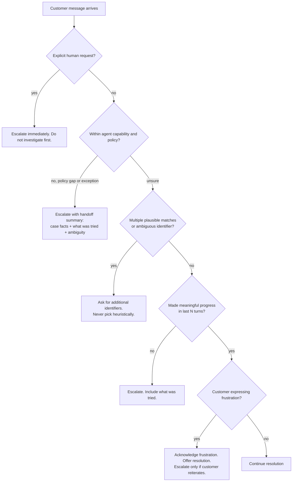

## Что покрывает этот раздел

Domain 5 — самый маленький домен по raw weight, но самый cross-cutting: every other domain assumes agent keeps critical facts straight, escalates at right moment, surfaces failures usefully to coordinator, persists findings across long sessions, calibrates own confidence, and preserves where each claim came from. Six task statements map to six concrete patterns covered below. Escalation sub-domain (5.2) tests one specific judgement: distinguish legitimate escalation triggers from two unreliable proxies (sentiment, self-reported confidence). Sample Question 8 is direct test of structured error context.

## Исходный материал (из официального guide)

### 5.1 Conversation context preservation

- Progressive summarization condenses numerical values, percentages, dates, and customer-stated expectations into vague paraphrases (`$487.32` → "around five hundred dollars").
- "Lost in the middle": models reliably use information at *start* and *end* of long inputs but may omit middle content (Liu et al., reproduced for Claude in Anthropic's own long-context guidance).
- Tool results accumulate disproportionately to relevance (40+ fields per `lookup_order` when 5 matter).
- Conversation history must be passed in full each turn — API is stateless and trimming earlier turns silently destroys coherence.
- Skills: extract transactional facts (amounts, dates, order numbers, statuses) into persistent "case facts" block included in every prompt outside summarized history; trim verbose tool outputs at boundary; place key findings at start of aggregated inputs with explicit section headers; require subagents to include metadata (dates, source locations, methodology) in structured outputs; have upstream agents return structured data instead of verbose reasoning chains when downstream context constrained.

### 5.2 Escalation & ambiguity resolution

- Legitimate escalation triggers: explicit customer request for a human, policy exception or policy gap (not just "complex case"), inability to make meaningful progress, multi-match ambiguity requiring more identifiers.
- Distinguish **immediate escalation on explicit demand** from **offering to resolve when straightforward** (acknowledge frustration, offer help, escalate only on reiteration).
- Unreliable proxies: sentiment-based escalation (frustration ≠ complexity) and self-reported confidence (LLMs are confidently wrong on same hard cases).
- Skills: explicit escalation criteria with few-shot examples; honor explicit human requests immediately without first investigating; escalate on policy ambiguity (competitor price-matching when policy only addresses own-site adjustments); ask for additional identifiers on multi-match results.

### 5.3 Error propagation in multi-agent systems

- Structured error context (failure type, attempted query, partial results, alternative approaches) enables coordinator recovery decisions.
- Distinguish access failures (timeout, permission denied — retry candidates) from valid empty results (query succeeded; nothing matched).
- Generic statuses like `"search unavailable"` hide what coordinator needs.
- Anti-patterns: silently suppressing errors (returning empty as success); terminating whole workflow on one subagent failure.
- Skills: structured error envelopes; distinguish access vs empty; subagent-local recovery for transient failures with propagation only of unrecoverable ones; synthesis output with coverage annotations marking well-supported vs gap areas.

### 5.4 Context in large codebase exploration

- Context degradation: in extended sessions, models give inconsistent answers and refer to "typical patterns" rather than specific classes discovered earlier.
- Scratchpad files persist key findings across context boundaries.
- Subagent delegation isolates verbose exploration so main agent only sees structured summaries.
- Structured state persistence (manifests) enables crash recovery: each agent exports state to known location; coordinator loads manifest on resume.
- Skills: spawn subagents for specific questions ("find all test files," "trace refund-flow dependencies"); maintain scratchpad files referenced for subsequent questions; summarize before spawning next phase of subagents; design crash recovery via structured agent state exports; use `/compact` when context fills with verbose discovery output.

### 5.5 Human review workflows & confidence calibration

- Aggregate accuracy (97% overall) can mask poor performance on specific document types or fields.
- Stratified random sampling of high-confidence stream surfaces novel error patterns.
- Field-level confidence scores, calibrated against labeled validation set, route review attention.
- Validate accuracy by document type and field segment before automating high-confidence extractions.
- Skills: stratified sampling; accuracy by document type and field; field-level confidence with calibration; route low-confidence items and ambiguous-source items to human review; prioritize limited reviewer capacity.

### 5.6 Information provenance in multi-source synthesis

- Source attribution is destroyed by summarization unless claim–source mappings are preserved as structured data.
- Conflicting statistics from credible sources should be annotated with both attributions, not arbitrarily resolved.
- Temporal data needs publication/collection dates so time-series differences are not misread as contradictions.
- Skills: subagents output structured claim–source mappings (URLs, doc names, excerpts) preserved through synthesis; reports distinguish well-established from contested findings; conflicting values explicitly annotated for coordinator to reconcile; publication/collection dates in every structured output; render content types appropriately (financial as tables, news as prose, technical as structured lists) instead of forcing uniform format.

## Six reliability patterns you must internalize

### Pattern 1 — The "case facts" block

Lossy progressive summarization is canonical Domain 5 failure: agent rolls earlier turns into paragraph that drops order number and customer's deadline, and next turn hallucinates both. Fix is separate, structured, append-only block of transactional facts included in *every* request *outside* summarized history. Block changes only when new verified fact added — never reword facts, never let LLM rewrite block.

```json
{
  "case_facts": {
    "case_id": "C-2026-04891",
    "customer": { "id": "CUS-77342", "verified_via": "get_customer" },
    "orders": [{ "id": "ORD-558102", "status": "delivered", "total_usd": 487.32, "delivered_on": "2026-05-08" }],
    "stated_expectations": [{ "verbatim": "I need the refund by Friday for my wedding", "stated_at_turn": 3 }],
    "policy_decisions": [{ "decision": "manager_approval_required", "reason": "refund > $400", "approved": false }],
    "open_questions": ["Has the item been returned?"]
  }
}
```

Place this at **top** of user message on every turn under `## CASE FACTS (authoritative — do not summarize)`. Two reasons: position effects (Liu et al., reproduced by Anthropic) put start-of-context tokens in high-recall region, and prompt caching keeps block hot between turns when it sits before volatile content. (Anthropic prompt caching guidance: stable content must physically precede volatile content; render order is `tools → system → messages`.)

### Pattern 2 — Trim tool outputs before they accumulate

A single order lookup may return 40+ fields. Across 20-turn session those fields dominate context. Normalize tool outputs at agent boundary to fields downstream reasoning actually uses.

Before:

```json
{ "id": "ORD-558102", "status": "delivered", "shipping_address": {...12 fields...},
  "billing_address": {...12 fields...}, "items": [...20 fields each...],
  "audit_log": [...8 entries...], "internal_flags": {...11 fields...},
  "warehouse_metadata": {...}, "carrier_tracking": [...] }
```

After (return-flow normalization):

```json
{ "id": "ORD-558102", "status": "delivered", "delivered_on": "2026-05-08",
  "total_usd": 487.32, "items_count": 3, "is_returnable": true }
```

Anthropic's *Writing effective tools for AI agents* and *Effective context engineering for AI agents* call this "context rot": accuracy degrades as raw token count grows, so answer is curation, not bigger window. Trim inside tool wrapper — once verbose output is in history you cannot retroactively un-include it.

### Pattern 3 — Structured error context

When subagent fails, return structured envelope, never a string. This is exact shape sample Question 8 rewards:

```json
{
  "status": "error",
  "failure_type": "timeout",
  "is_transient": true,
  "agent": "web_search",
  "attempted": { "query": "Q1 2026 generative-music revenue Spotify", "timeout_ms": 30000, "retries": 2 },
  "partial_results": [{ "url": "https://...", "snippet": "..." }],
  "alternatives": [
    "Retry with shorter query 'Spotify generative music revenue 2026'",
    "Delegate to internal_kb_search for analyst notes",
    "Proceed with partial_results and annotate coverage gap"
  ],
  "coverage_gap": "music industry revenue figures incomplete"
}
```

Two distinctions exam tests directly:

- **Access failure vs valid empty result.** Timeout, 5xx, permission error → `failure_type: "access"`, retry candidate. Successful query returning zero rows is `status: "ok", results: []` — treating it as error wastes work.
- **Local recovery vs propagation.** Subagents retry transient failures themselves (one or two attempts with backoff). Only propagate what they cannot resolve, always with `attempted` and `partial_results`.

In sample Q8: option B's "search unavailable after retries" hides what was attempted, option C's empty-but-marked-success destroys recoverability, option D kills independent subagents that succeeded. Only A — structured envelope — gives coordinator enough information to recover.

Synthesis output mirrors this with **coverage annotations**:

```json
{
  "well_supported": ["Streaming music revenue grew 14% YoY"],
  "partially_supported": ["Generative-music ARR estimate based on a single analyst note"],
  "gaps": ["Film industry not covered; subagent timed out and was not retried"]
}
```

### Pattern 4 — Scratchpad + manifest for long sessions

Long codebase exploration burns context fast — by seventh question model refers to "typical service patterns" rather than specific `BillingService` found in turn 3. Two layers of defense:

1. **Scratchpad files on disk.** Write distilled findings to `.claude/scratch/<topic>.md`. Re-read scratchpad in subsequent turns. Survives `/compact` and session restart.
2. **Subagent isolation.** Spawn subagent for verbose work and have it return 200-token summary. Main agent never sees 50K tokens of grep output.

Typical layout:

```
.claude/scratch/
├── manifest.json              # coordinator state: phase, completed steps, open questions
├── architecture.md            # one-page distilled findings on the system shape
├── refund-flow.md             # specific subgraph traced by a subagent
├── tests-inventory.md         # output of "find all test files" subagent
└── decisions.md               # ADR-style log of architectural decisions reached so far
```

Minimal manifest:

```json
{
  "session_id": "explore-2026-05-15-refunds",
  "phase": "tracing dependencies",
  "completed_steps": ["map services", "inventory tests"],
  "open_questions": ["Does notification service block refund commit?"],
  "scratchpad_files": [
    { "path": ".claude/scratch/architecture.md", "summary_for_resume": "..." },
    { "path": ".claude/scratch/refund-flow.md",  "summary_for_resume": "..." }
  ],
  "subagents": [{ "name": "test-inventory", "status": "complete", "output": ".claude/scratch/tests-inventory.md" }]
}
```

On resume, coordinator loads `manifest.json`, re-injects `summary_for_resume`, and re-reads scratchpad files only when specific question requires it.

**When to use `/compact`.** Claude Code's `/compact` summarizes conversation while preserving in-progress tasks, file operations, and architectural decisions; auto-compact fires near 95% of 200K window by default. Use manual `/compact` *before* threshold and *with* explicit preservation: `/compact preserve all file paths, the open questions list, and the manifest path`. Anything already written to scratchpad survives compaction trivially because it lives on disk — that is what makes `/compact` safe mid-investigation.

### Pattern 5 — Confidence + stratified sampling

Auto-approving everything a 97%-accurate model is "sure of" hides two failures:

- **Aggregate masks per-segment failure.** 99.5% on invoices and 65% on contracts averages to fine while contracts pipeline silently corrupts data.
- **Model is confident on wrong cases.** Raw probabilities poorly calibrated; novel error patterns enter high-confidence stream undetected.

Fix has three parts:

1. **Field-level confidence**, not document-level. `total_amount` may be high while `payment_terms` is low.
2. **Calibration against a labeled validation set.** Bucket predictions by raw confidence, measure actual accuracy per bucket, and pick threshold where auto-approved stream meets error budget. Recalibrate per document type.
3. **Stratified random sampling of high-confidence stream.** Route ~2% of auto-approved items to human review, stratified by document type and field, to surface novel errors.

```
                    ┌─────────────────┐
extracted_records → │ confidence by   │
                    │ field & doctype │
                    └────────┬────────┘
                             │
              ┌──────────────┼──────────────┐
              ▼              ▼              ▼
        low confidence  ambiguous src   high confidence
         → review        → review         → auto-approve
                                          │  ↑
                                          │  │ stratified 2% sample
                                          ▼  │ feeds back into
                                       audit queue
```

Route low-confidence and ambiguous-source items to humans first; audit-sample queue catches novel patterns escaping into auto-approved stream. Recalibrate when new document type ships or model changes.

### Pattern 6 — Provenance through synthesis

"Summarize what these 12 sources say about X" produces prose with no traceable links from claim to source. Require subagents to emit **structured claim–source mappings** that synthesis step *must* preserve:

```json
{
  "claims": [
    {
      "claim": "Streaming music revenue grew 14% YoY in Q1 2026",
      "support": [{
        "source_url": "https://example.com/riaa-q1-2026",
        "source_name": "RIAA Q1 2026 report",
        "excerpt": "Total streaming revenue rose 14.0% year-over-year...",
        "publication_date": "2026-04-22"
      }],
      "confidence": "well_supported"
    },
    {
      "claim": "Generative-music tools reduced session-musician hiring",
      "support": [
        { "source_name": "Analyst note A", "value_pct": 9, "publication_date": "2026-03-10" },
        { "source_name": "Analyst note B", "value_pct": 3, "publication_date": "2026-04-02" }
      ],
      "conflict": { "values": [9, 3], "note": "Methodology differs (survey vs payroll)" },
      "confidence": "contested"
    }
  ]
}
```

Three rules exam expects:

- **Annotate conflicts; do not pick.** When credible sources disagree, surface both with attribution. Arbitrary selection is failure mode.
- **Always carry dates.** A 2024 figure and 2026 figure are not contradictions; they are time series. Without `publication_date`, synthesis manufactures fake contradictions.
- **Render content types appropriately.** Financial → tables, news → prose, technical → structured lists. Forcing everything through same prose synthesizer destroys source structure.

Anthropic's *How we built our multi-agent research system* describes this at production scale: subagents work in parallel with separate context windows, returning structured findings to lead agent, which composes final report and owns citation integrity.

## Escalation decision tree



Four legitimate trigger lanes (E1–E4) map to knowledge bullets in 5.2. Frustration lane (H) is trap — *not* escalation trigger on its own, and sentiment-based auto-escalation is canonical wrong answer in sample Question 3.

## Anti-patterns to memorize

- **Sentiment-based auto-escalation.** Frustration ≠ complexity.
- **Self-reported confidence as routing signal.** Agent is confidently wrong on same cases you most want escalated.
- **Generic `"operation failed"` errors.** Strip failure type, attempted query, and partial results coordinator could have used.
- **Empty result returned as success when call actually failed.** Silent data corruption — coordinator believes nothing matched when search never ran.
- **Terminating workflow on a single subagent failure.** Discards independent subagents that succeeded.
- **Aggregate 97% accuracy without per-segment breakdown.** Hides one document type collapsing while others stay healthy.
- **Summarizing claims without preserving claim → source mapping.** Once gone you cannot reconstruct it; you can only re-search.
- **Letting rolling summary rewrite numbers, dates, or verbatim quotes.** Pin those in untouchable case-facts block.
- **Burying important findings in middle of long input.** Lost-in-the-middle is real; put critical findings at top with header.
- **Treating `@import` or giant CLAUDE.md as context-saving optimization.** They expand context. Use scratchpads + subagent isolation + path-scoped rules.

## Cross-cutting integration with other domains

- **Scenario 1 (Customer Support, Q1–3).** Question 3 directly tests 5.2 escalation calibration. "Case facts" pattern is also right answer to almost any question about misidentified accounts or lost details across long conversations. Question 1's programmatic prerequisite for `get_customer` pairs naturally with case-facts block: hook enforces verification, and verified ID lands in case-facts block where downstream tools rely on it.
- **Scenario 3 (Multi-Agent Research, Q7–9).** Question 8 *is* Pattern 3 of this section. Question 9 (scoped `verify_fact` tool for synthesis) presupposes provenance pattern of 5.6 — you cannot verify what you cannot trace back to source. "Lead agent saves plan to memory" practice from Anthropic's multi-agent research blog is manifest pattern of 5.4 in production.
- **Scenario 2 / Code Generation (Q4–6).** Long codebase exploration sessions hit context degradation immediately; scratchpad + subagent + `/compact` triad of 5.4 is practical answer, paired with path-scoped rules and modular CLAUDE.md guidance from Section 7.

Every other domain assumes agent is *reliable*. Domain 5 is what makes that assumption hold in production.

## Exam-style focus points

- Four legitimate escalation triggers: explicit human request, policy exception/gap, inability to make progress, multi-match ambiguity. Two unreliable proxies: sentiment, self-reported confidence.
- Structured-error envelope shape (sample Q8): `failure_type`, `attempted`, `partial_results`, `alternatives`. That exact shape is right answer when subagent times out.
- **Access failure** (retry candidate) vs **valid empty result** (no retry).
- Lossy summarization → "case facts block, included every turn, outside the summary."
- 40+ field tool outputs → "trim at tool wrapper to fields downstream uses."
- Long codebase session "model refers to typical patterns" → "scratchpad files + subagents." `/compact` is mid-session lever.
- 97% aggregate accuracy is *not* sufficient to auto-approve until you have per-document-type, per-field accuracy plus stratified-sample audit on high-confidence stream.
- LLM self-reported confidence is poorly calibrated. Calibrate against labeled validation set.
- Conflicting statistics in synthesis → annotate both with sources, never pick. Always require dates.
- Lost-in-the-middle applies to Claude too; place key findings at start of long inputs with explicit headers.
- `/compact` preserves in-progress tasks, file paths, and architectural decisions but loses detailed tool output; pair it with on-disk scratchpads.
- Prompt caching needs stable content before volatile content (`tools → system → messages`). Case-facts block is perfect cache target *if appended, not rewritten*.

## References

- Anthropic, *Effective context engineering for AI agents* — [anthropic.com/engineering/effective-context-engineering-for-ai-agents](https://www.anthropic.com/engineering/effective-context-engineering-for-ai-agents)
- Anthropic, *Writing effective tools for AI agents* — [anthropic.com/engineering/writing-tools-for-agents](https://www.anthropic.com/engineering/writing-tools-for-agents)
- Anthropic, *How we built our multi-agent research system* — [anthropic.com/engineering/multi-agent-research-system](https://www.anthropic.com/engineering/multi-agent-research-system)
- Anthropic, *Building effective agents* — [anthropic.com/engineering/building-effective-agents](https://www.anthropic.com/engineering/building-effective-agents)
- Anthropic, *Prompting best practices for long context* — [docs.anthropic.com/en/docs/build-with-claude/prompt-engineering/long-context-tips](https://docs.anthropic.com/en/docs/build-with-claude/prompt-engineering/long-context-tips)
- Anthropic, *Context windows* — [docs.anthropic.com/en/docs/build-with-claude/context-windows](https://docs.anthropic.com/en/docs/build-with-claude/context-windows)
- Anthropic, *Prompt caching* — [docs.anthropic.com/en/docs/build-with-claude/prompt-caching](https://docs.anthropic.com/en/docs/build-with-claude/prompt-caching)
- Anthropic, *Prompt engineering for Claude's long context window* — [anthropic.com/news/prompting-long-context](https://www.anthropic.com/news/prompting-long-context)
- Anthropic, *Memory tool* — [docs.anthropic.com/en/docs/agents-and-tools/tool-use/memory-tool](https://docs.anthropic.com/en/docs/agents-and-tools/tool-use/memory-tool)
- Anthropic, *Using agent memory (Managed Agents)* — [platform.claude.com/docs/en/managed-agents/memory](https://platform.claude.com/docs/en/managed-agents/memory)
- Anthropic, *Persist sessions to external storage* — [code.claude.com/docs/en/agent-sdk/session-storage](https://code.claude.com/docs/en/agent-sdk/session-storage)
- Anthropic, *Rewind file changes with checkpointing* — [code.claude.com/docs/en/agent-sdk/file-checkpointing](https://code.claude.com/docs/en/agent-sdk/file-checkpointing)
- Liu et al., *Lost in the Middle: How Language Models Use Long Contexts*, TACL 2024 — [arxiv.org/abs/2307.03172](https://arxiv.org/abs/2307.03172)
