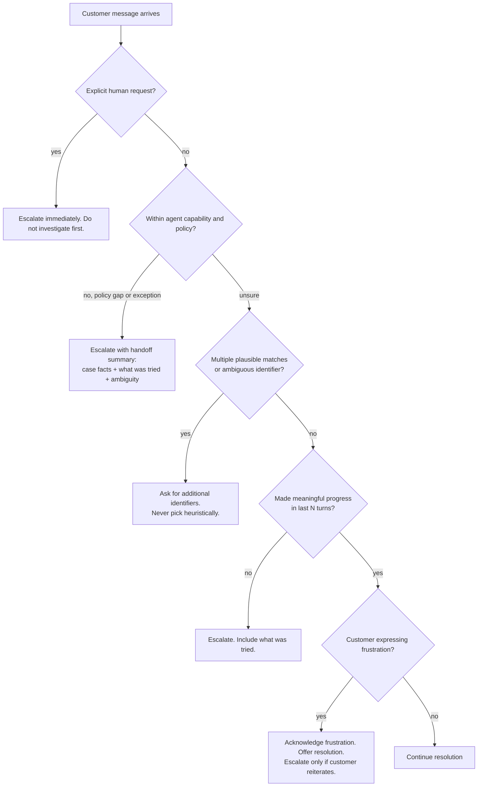

## Что покрывает этот раздел

Домен 5 — самый маленький домен по сырому весу, но самый сквозной: каждый другой домен предполагает, что агент удерживает критичные факты, эскалирует в нужный момент, полезно для координатора показывает отказы, сохраняет находки между длинными сессиями, калибрует собственную уверенность и сохраняет, откуда взялось каждое утверждение. Шесть пунктов задач отображаются на шесть конкретных паттернов, разбираемых ниже. Подобласть эскалации (5.2) проверяет одно конкретное суждение: отличить легитимные триггеры эскалации от двух ненадёжных прокси (тональность, самооцениваемая уверенность). Sample Question 8 — прямая проверка структурированного контекста ошибки.

## Исходный материал (из официального руководства)

### 5.1 Сохранение контекста диалога

- Прогрессивная суммаризация уплотняет числовые значения, проценты, даты и ожидания, озвученные клиентом, в размытые перифразы (`$487.32` → "around five hundred dollars").
- «Lost in the middle»: модели надёжно используют информацию в *начале* и *конце* длинного ввода, но могут опустить содержимое в середине (Liu et al., воспроизведено для Claude в собственных рекомендациях Anthropic по длинному контексту).
- Результаты инструментов накапливаются непропорционально релевантности (40+ полей на `lookup_order`, когда важны 5).
- История диалога должна передаваться целиком на каждом ходу — API без состояния, и обрезка ранних ходов молча разрушает связность.
- Навыки: извлекайте транзакционные факты (суммы, даты, номера заказов, статусы) в постоянный блок «фактов по делу», включаемый в каждый промпт вне суммаризованной истории; обрезайте многословные выводы инструментов на границе; ставьте ключевые находки в начале агрегированных вводов с явными заголовками разделов; требуйте от субагентов включать метаданные (даты, расположение источника, методологию) в структурированный вывод; пусть восходящие агенты возвращают структурированные данные вместо многословных цепочек рассуждения, когда контекст ниже по конвейеру ограничен.

### 5.2 Эскалация и разрешение неоднозначности

- Легитимные триггеры эскалации: явный запрос клиента на человека, исключение из политики или пробел в политике (а не просто «сложный случай»), невозможность сделать осмысленный прогресс, многозначное совпадение, требующее дополнительных идентификаторов.
- Различайте **немедленную эскалацию по явному требованию** и **предложение решить, если просто** (признать раздражение, предложить помощь, эскалировать только при повторной просьбе).
- Ненадёжные прокси: эскалация по тональности (раздражение ≠ сложность) и самооцениваемая уверенность (LLM уверенно ошибаются на одних и тех же сложных случаях).
- Навыки: явные критерии эскалации с few-shot примерами; уважайте явные запросы человека немедленно, не начиная сначала расследовать; эскалируйте при неоднозначности политики (price-matching конкурента, когда политика описывает только корректировки на собственном сайте); запрашивайте дополнительные идентификаторы при многозначных совпадениях.

### 5.3 Распространение ошибок в многоагентных системах

- Структурированный контекст ошибки (тип отказа, попытанный запрос, частичные результаты, альтернативные подходы) позволяет координатору принимать решения о восстановлении.
- Различайте отказы доступа (тайм-аут, отказ в правах — кандидаты на повтор) и валидные пустые результаты (запрос успешен; ничего не совпало).
- Общие статусы вроде `"search unavailable"` скрывают то, что нужно координатору.
- Антипаттерны: молчаливое подавление ошибок (возврат пустого как успеха); прерывание всего рабочего процесса из-за отказа одного субагента.
- Навыки: структурированные конверты ошибок; различение доступа против пустого результата; локальное восстановление в субагенте для временных отказов с распространением только неустранимых; вывод синтеза с аннотациями покрытия, помечающими хорошо подкреплённые и пробельные области.

### 5.4 Контекст при исследовании крупной кодовой базы

- Деградация контекста: в длинных сессиях модели дают непоследовательные ответы и ссылаются на «типичные паттерны» вместо конкретных классов, обнаруженных ранее.
- Файлы-черновики сохраняют ключевые находки через границы контекста.
- Делегирование субагентам изолирует многословное исследование, чтобы основной агент видел только структурированные сводки.
- Структурированная персистентность состояния (манифесты) позволяет восстановление после сбоя: каждый агент экспортирует состояние в известное место; координатор загружает манифест при возобновлении.
- Навыки: запускайте субагентов под конкретные вопросы («найти все тестовые файлы», «трассировать зависимости refund-flow»); ведите файлы-черновики, на которые ссылаетесь в последующих вопросах; суммируйте перед запуском следующей фазы субагентов; проектируйте восстановление после сбоя через структурированные экспорты состояния агента; используйте `/compact`, когда контекст заполняется многословным исследовательским выводом.

### 5.5 Процессы человеческого ревью и калибровка уверенности

- Агрегированная точность (97% в целом) может маскировать плохую работу на отдельных типах документов или полях.
- Стратифицированная случайная выборка из потока с высокой уверенностью вытаскивает на свет новые шаблоны ошибок.
- Уверенность на уровне поля, откалиброванная по размеченному валидационному набору, направляет внимание ревьюера.
- Валидируйте точность по типу документа и сегменту поля до автоматизации извлечений с высокой уверенностью.
- Навыки: стратифицированная выборка; точность по типу документа и полю; уверенность на уровне поля с калибровкой; маршрутизация элементов с низкой уверенностью и неоднозначным источником на человеческое ревью; приоритизация ограниченной ёмкости ревьюеров.

### 5.6 Провенанс информации при синтезе из многих источников

- Атрибуция источников разрушается суммаризацией, если связки утверждение–источник не сохранены как структурированные данные.
- Конфликтующие статистики из достоверных источников следует аннотировать обеими атрибуциями, а не разрешать произвольно.
- Временным данным нужны даты публикации/сбора, чтобы различия временного ряда не были прочитаны как противоречия.
- Навыки: субагенты выдают структурированные связки утверждение–источник (URL, имена документов, фрагменты), сохраняемые через синтез; отчёты различают хорошо устоявшиеся и спорные находки; конфликтующие значения явно аннотируются для разрешения координатором; даты публикации/сбора в каждом структурированном выводе; рендерите типы контента уместно (финансовый как таблицы, новости как прозу, технический как структурированные списки) вместо принуждения к единому формату.

## Шесть паттернов надёжности, которые надо усвоить

### Паттерн 1 — Блок «фактов по делу»

Лоссовая прогрессивная суммаризация — это каноничный отказ домена 5: агент сворачивает ранние ходы в абзац, теряющий номер заказа и дедлайн клиента, а следующий ход галлюцинирует и то, и другое. Решение — отдельный, структурированный, только-добавляемый блок транзакционных фактов, включаемый в *каждый* запрос *вне* суммаризованной истории. Блок меняется только при добавлении нового верифицированного факта — никогда не переформулируйте факты, никогда не давайте LLM переписать блок.

```json
{
  "case_facts": {
    "case_id": "C-2026-04891",
    "customer": { "id": "CUS-77342", "verified_via": "get_customer" },
    "orders": [{ "id": "ORD-558102", "status": "delivered", "total_usd": 487.32, "delivered_on": "2026-05-08" }],
    "stated_expectations": [{ "verbatim": "I need the refund by Friday for my wedding", "stated_at_turn": 3 }],
    "policy_decisions": [{ "decision": "manager_approval_required", "reason": "refund > $400", "approved": false }],
    "open_questions": ["Has the item been returned?"]
  }
}
```

Размещайте это в **начале** пользовательского сообщения на каждом ходу под заголовком `## CASE FACTS (authoritative — do not summarize)`. Две причины: позиционные эффекты (Liu et al., воспроизведено Anthropic) ставят токены начала контекста в зону высокого recall, и prompt caching удерживает блок горячим между ходами, когда он стоит до любого изменчивого контента. (Рекомендации Anthropic по prompt caching: стабильный контент должен физически предшествовать изменчивому; порядок рендеринга — `tools → system → messages`.)

### Паттерн 2 — Обрезайте выводы инструментов до их накопления

Один lookup заказа может вернуть 40+ полей. За 20-ходовую сессию эти поля доминируют в контексте. Нормализуйте выводы инструментов на границе агента до полей, которые действительно использует нижестоящее рассуждение.

До:

```json
{ "id": "ORD-558102", "status": "delivered", "shipping_address": {...12 fields...},
  "billing_address": {...12 fields...}, "items": [...20 fields each...],
  "audit_log": [...8 entries...], "internal_flags": {...11 fields...},
  "warehouse_metadata": {...}, "carrier_tracking": [...] }
```

После (нормализация возвратного потока):

```json
{ "id": "ORD-558102", "status": "delivered", "delivered_on": "2026-05-08",
  "total_usd": 487.32, "items_count": 3, "is_returnable": true }
```

Тексты Anthropic *Writing effective tools for AI agents* и *Effective context engineering for AI agents* называют это «context rot»: точность деградирует с ростом сырого числа токенов, поэтому ответ — кураторство, а не большее окно. Обрезайте внутри обёртки инструмента — как только многословный вывод попал в историю, его уже нельзя ретроактивно выкинуть.

### Паттерн 3 — Структурированный контекст ошибки

Когда субагент падает, возвращайте структурированный конверт, а не строку. Это ровно та форма, которую вознаграждает Sample Question 8:

```json
{
  "status": "error",
  "failure_type": "timeout",
  "is_transient": true,
  "agent": "web_search",
  "attempted": { "query": "Q1 2026 generative-music revenue Spotify", "timeout_ms": 30000, "retries": 2 },
  "partial_results": [{ "url": "https://...", "snippet": "..." }],
  "alternatives": [
    "Retry with shorter query 'Spotify generative music revenue 2026'",
    "Delegate to internal_kb_search for analyst notes",
    "Proceed with partial_results and annotate coverage gap"
  ],
  "coverage_gap": "music industry revenue figures incomplete"
}
```

Два различия, которые экзамен проверяет напрямую:

- **Отказ доступа против валидного пустого результата.** Тайм-аут, 5xx, отказ в правах → `failure_type: "access"`, кандидат на повтор. Успешный запрос, вернувший ноль строк, — это `status: "ok", results: []`; трактовать его как ошибку — пустая работа.
- **Локальное восстановление против распространения.** Субагенты сами повторяют временные отказы (одна-две попытки с backoff). Наверх распространяйте только то, что разрешить не удалось, всегда с `attempted` и `partial_results`.

В Sample Q8: вариант B «search unavailable after retries» скрывает то, что попыталось произойти; вариант C — пусто-но-помечено-как-успех — разрушает возможность восстановления; вариант D убивает независимых субагентов, которые отработали. Только A — структурированный конверт — даёт координатору достаточно информации для восстановления.

Вывод синтеза зеркалит это **аннотациями покрытия**:

```json
{
  "well_supported": ["Streaming music revenue grew 14% YoY"],
  "partially_supported": ["Generative-music ARR estimate based on a single analyst note"],
  "gaps": ["Film industry not covered; subagent timed out and was not retried"]
}
```

### Паттерн 4 — Черновик + манифест для длинных сессий

Долгое исследование кодовой базы быстро жжёт контекст — к седьмому вопросу модель ссылается на «типичные паттерны сервиса» вместо конкретного `BillingService`, найденного на ходу 3. Два слоя защиты:

1. **Файлы-черновики на диске.** Пишите дистиллированные находки в `.claude/scratch/<topic>.md`. Перечитывайте черновик в последующих ходах. Переживают `/compact` и перезапуск сессии.
2. **Изоляция субагентом.** Запускайте субагента под многословную работу, и пусть он возвращает сводку на 200 токенов. Основной агент никогда не видит 50К токенов grep-вывода.

Типичная раскладка:

```
.claude/scratch/
├── manifest.json              # coordinator state: phase, completed steps, open questions
├── architecture.md            # one-page distilled findings on the system shape
├── refund-flow.md             # specific subgraph traced by a subagent
├── tests-inventory.md         # output of "find all test files" subagent
└── decisions.md               # ADR-style log of architectural decisions reached so far
```

Минимальный манифест:

```json
{
  "session_id": "explore-2026-05-15-refunds",
  "phase": "tracing dependencies",
  "completed_steps": ["map services", "inventory tests"],
  "open_questions": ["Does notification service block refund commit?"],
  "scratchpad_files": [
    { "path": ".claude/scratch/architecture.md", "summary_for_resume": "..." },
    { "path": ".claude/scratch/refund-flow.md",  "summary_for_resume": "..." }
  ],
  "subagents": [{ "name": "test-inventory", "status": "complete", "output": ".claude/scratch/tests-inventory.md" }]
}
```

При возобновлении координатор загружает `manifest.json`, повторно вкладывает `summary_for_resume` и перечитывает файлы-черновики только тогда, когда конкретный вопрос этого требует.

**Когда использовать `/compact`.** Команда `/compact` в Claude Code суммирует диалог, сохраняя задачи в работе, операции с файлами и архитектурные решения; авто-компакция срабатывает около 95% от окна 200К по умолчанию. Используйте ручной `/compact` *до* порога и *с* явным сохранением: `/compact preserve all file paths, the open questions list, and the manifest path`. Всё, что вы уже записали в черновик, переживает компакцию без труда, потому что лежит на диске — это и делает `/compact` безопасным посреди расследования.

### Паттерн 5 — Уверенность + стратифицированная выборка

Авто-одобрение всего, в чём модель с точностью 97% «уверена», скрывает два провала:

- **Агрегат маскирует отказ на сегменте.** 99.5% на счетах и 65% на контрактах усредняются до «нормально», пока конвейер контрактов молча корёжит данные.
- **Модель уверена в неверных случаях.** Сырые вероятности плохо откалиброваны; новые шаблоны ошибок попадают в поток с высокой уверенностью незамеченными.

Лечение состоит из трёх частей:

1. **Уверенность на уровне поля**, а не документа. У `total_amount` уверенность может быть высокой, а у `payment_terms` — низкой.
2. **Калибровка по размеченному валидационному набору.** Раскладывайте предсказания по корзинам сырой уверенности, измеряйте реальную точность по каждой корзине и выбирайте порог, на котором поток авто-одобрения укладывается в ваш бюджет ошибок. Перекалибровывайте по типу документа.
3. **Стратифицированная случайная выборка из потока с высокой уверенностью.** Направляйте ~2% авто-одобренных элементов на человеческое ревью, стратифицированно по типу документа и полю, чтобы вытаскивать на свет новые ошибки.

```
                    ┌─────────────────┐
extracted_records → │ confidence by   │
                    │ field & doctype │
                    └────────┬────────┘
                             │
              ┌──────────────┼──────────────┐
              ▼              ▼              ▼
        low confidence  ambiguous src   high confidence
         → review        → review         → auto-approve
                                          │  ↑
                                          │  │ stratified 2% sample
                                          ▼  │ feeds back into
                                       audit queue
```

Сначала направляйте элементы с низкой уверенностью и неоднозначным источником людям; очередь аудит-выборки ловит новые шаблоны, ускользающие в поток авто-одобрения. Перекалибровывайте, когда появляется новый тип документа или меняется модель.

### Паттерн 6 — Провенанс через синтез

Запрос «суммируй, что эти 12 источников говорят про X» порождает прозу без отслеживаемых связей от утверждения к источнику. Требуйте от субагентов выдавать **структурированные связки утверждение–источник**, которые шаг синтеза *обязан* сохранить:

```json
{
  "claims": [
    {
      "claim": "Streaming music revenue grew 14% YoY in Q1 2026",
      "support": [{
        "source_url": "https://example.com/riaa-q1-2026",
        "source_name": "RIAA Q1 2026 report",
        "excerpt": "Total streaming revenue rose 14.0% year-over-year...",
        "publication_date": "2026-04-22"
      }],
      "confidence": "well_supported"
    },
    {
      "claim": "Generative-music tools reduced session-musician hiring",
      "support": [
        { "source_name": "Analyst note A", "value_pct": 9, "publication_date": "2026-03-10" },
        { "source_name": "Analyst note B", "value_pct": 3, "publication_date": "2026-04-02" }
      ],
      "conflict": { "values": [9, 3], "note": "Methodology differs (survey vs payroll)" },
      "confidence": "contested"
    }
  ]
}
```

Три правила, которых ждёт экзамен:

- **Аннотируйте конфликты; не выбирайте.** Когда достоверные источники расходятся, показывайте оба с атрибуцией. Произвольный выбор — режим отказа.
- **Всегда несите даты.** Цифра за 2024 и цифра за 2026 — не противоречие; это временной ряд. Без `publication_date` синтез изобретает фальшивые противоречия.
- **Рендерите типы контента уместно.** Финансовый → таблицы, новости → проза, технический → структурированные списки. Принуждение всего к одному прозаическому синтезатору разрушает структуру источника.

Текст Anthropic *How we built our multi-agent research system* описывает это на продакшен-масштабе: субагенты работают параллельно с отдельными контекстными окнами, возвращая структурированные находки ведущему агенту, который компонует финальный отчёт и владеет целостностью цитирования.

## Дерево решений по эскалации



Четыре легитимные ветки-триггера (E1–E4) отображаются на пункты знаний из 5.2. Ветка раздражения (H) — это ловушка: *не* самостоятельный триггер эскалации, а авто-эскалация по тональности — каноничный неправильный ответ в Sample Question 3.

## Антипаттерны, которые надо запомнить

- **Авто-эскалация по тональности.** Раздражение ≠ сложность.
- **Самооцениваемая уверенность как сигнал маршрутизации.** Агент уверенно ошибается на тех самых случаях, которые вы больше всего хотели бы эскалировать.
- **Общие ошибки `"operation failed"`.** Отрезают тип отказа, попытанный запрос и частичные результаты, которые координатор мог бы использовать.
- **Пустой результат, возвращённый как успех, когда вызов на самом деле упал.** Тихая порча данных — координатор верит, что ничего не совпало, тогда как поиск вообще не запустился.
- **Прерывание рабочего процесса из-за отказа одного субагента.** Выбрасывает независимых субагентов, которые успешно отработали.
- **Агрегированная точность 97% без разбивки по сегментам.** Прячет один тип документа, у которого всё разваливается, пока другие здоровы.
- **Суммаризация утверждений без сохранения связки утверждение → источник.** Раз потеряв её, восстановить невозможно — только переискать.
- **Позволить катящейся сводке переписать числа, даты или дословные цитаты.** Закрепляйте их в неприкосновенном блоке фактов по делу.
- **Закопать важные находки в середине длинного ввода.** «Lost in the middle» — это реальность; ставьте критичные находки в начале с заголовком.
- **Трактовать `@import` или гигантский CLAUDE.md как оптимизацию экономии контекста.** Они расширяют контекст. Используйте черновики + изоляцию субагентом + правила с областью путей.

## Сквозная интеграция с другими доменами

- **Сценарий 1 (Customer Support Resolution Agent, Q1–3).** Question 3 напрямую проверяет калибровку эскалации из 5.2. Паттерн «фактов по делу» — также правильный ответ почти на любой вопрос о перепутанных аккаунтах или потерянных деталях в длинных диалогах. Программная предпосылка для `get_customer` из Question 1 естественно сочетается с блоком фактов по делу: хук обеспечивает верификацию, а верифицированный идентификатор оказывается в блоке фактов по делу, где на него полагаются нижестоящие инструменты.
- **Сценарий 3 (Multi-Agent Research System, Q7–9).** Question 8 *и есть* паттерн 3 этого раздела. Question 9 (узкоспециализированный инструмент `verify_fact` для синтеза) предполагает паттерн провенанса из 5.6 — нельзя верифицировать то, что нельзя проследить обратно к источнику. Практика «ведущий агент сохраняет план в память» из блога Anthropic о multi-agent research — это паттерн манифеста из 5.4 на продакшен-масштабе.
- **Сценарий 2 / Code Generation with Claude Code (Q4–6).** Длинные сессии исследования кодовой базы немедленно упираются в деградацию контекста; триада «черновик + субагент + `/compact`» из 5.4 — это практический ответ, в паре с правилами с областью путей и модульными рекомендациями по CLAUDE.md из раздела 7.

Каждый другой домен предполагает, что агент *надёжен*. Домен 5 — это то, что заставляет это предположение держаться в продакшене.

## Ключевые акценты для экзамена

- Четыре легитимных триггера эскалации: явный запрос человека, исключение/пробел в политике, невозможность сделать прогресс, многозначное совпадение. Два ненадёжных прокси: тональность, самооцениваемая уверенность.
- Форма структурированного конверта ошибки (Sample Q8): `failure_type`, `attempted`, `partial_results`, `alternatives`. Именно эта форма — правильный ответ, когда субагент попал в тайм-аут.
- **Отказ доступа** (кандидат на повтор) против **валидного пустого результата** (без повтора).
- Лоссовая суммаризация → «блок фактов по делу, включаемый каждый ход, вне сводки».
- Выводы инструментов с 40+ полями → «обрезать в обёртке инструмента до полей, которые использует нижестоящее звено».
- Длинная сессия по кодовой базе «модель ссылается на типичные паттерны» → «файлы-черновики + субагенты». `/compact` — это рычаг посреди сессии.
- Агрегированная точность 97% *недостаточна* для авто-одобрения, пока у вас нет точности по типу документа и по полю плюс аудит по стратифицированной выборке из потока с высокой уверенностью.
- Самооцениваемая уверенность LLM плохо откалибрована. Калибруйте по размеченному валидационному набору.
- Конфликтующие статистики при синтезе → аннотируйте обе с источниками, никогда не выбирайте. Всегда требуйте даты.
- «Lost in the middle» применимо и к Claude; ставьте ключевые находки в начале длинных вводов с явными заголовками.
- `/compact` сохраняет задачи в работе, пути к файлам и архитектурные решения, но теряет подробный вывод инструментов; сочетайте его с черновиками на диске.
- Prompt caching требует стабильного контента до изменчивого (`tools → system → messages`). Блок фактов по делу — идеальная цель для кэша, *если его дополнять, а не переписывать*.

## Ссылки

- Anthropic, *Effective context engineering for AI agents* — [anthropic.com/engineering/effective-context-engineering-for-ai-agents](https://www.anthropic.com/engineering/effective-context-engineering-for-ai-agents)
- Anthropic, *Writing effective tools for AI agents* — [anthropic.com/engineering/writing-tools-for-agents](https://www.anthropic.com/engineering/writing-tools-for-agents)
- Anthropic, *How we built our multi-agent research system* — [anthropic.com/engineering/multi-agent-research-system](https://www.anthropic.com/engineering/multi-agent-research-system)
- Anthropic, *Building effective agents* — [anthropic.com/engineering/building-effective-agents](https://www.anthropic.com/engineering/building-effective-agents)
- Anthropic, *Prompting best practices for long context* — [docs.anthropic.com/en/docs/build-with-claude/prompt-engineering/long-context-tips](https://docs.anthropic.com/en/docs/build-with-claude/prompt-engineering/long-context-tips)
- Anthropic, *Context windows* — [docs.anthropic.com/en/docs/build-with-claude/context-windows](https://docs.anthropic.com/en/docs/build-with-claude/context-windows)
- Anthropic, *Prompt caching* — [docs.anthropic.com/en/docs/build-with-claude/prompt-caching](https://docs.anthropic.com/en/docs/build-with-claude/prompt-caching)
- Anthropic, *Prompt engineering for Claude's long context window* — [anthropic.com/news/prompting-long-context](https://www.anthropic.com/news/prompting-long-context)
- Anthropic, *Memory tool* — [docs.anthropic.com/en/docs/agents-and-tools/tool-use/memory-tool](https://docs.anthropic.com/en/docs/agents-and-tools/tool-use/memory-tool)
- Anthropic, *Using agent memory (Managed Agents)* — [platform.claude.com/docs/en/managed-agents/memory](https://platform.claude.com/docs/en/managed-agents/memory)
- Anthropic, *Persist sessions to external storage* — [code.claude.com/docs/en/agent-sdk/session-storage](https://code.claude.com/docs/en/agent-sdk/session-storage)
- Anthropic, *Rewind file changes with checkpointing* — [code.claude.com/docs/en/agent-sdk/file-checkpointing](https://code.claude.com/docs/en/agent-sdk/file-checkpointing)
- Liu et al., *Lost in the Middle: How Language Models Use Long Contexts*, TACL 2024 — [arxiv.org/abs/2307.03172](https://arxiv.org/abs/2307.03172)
